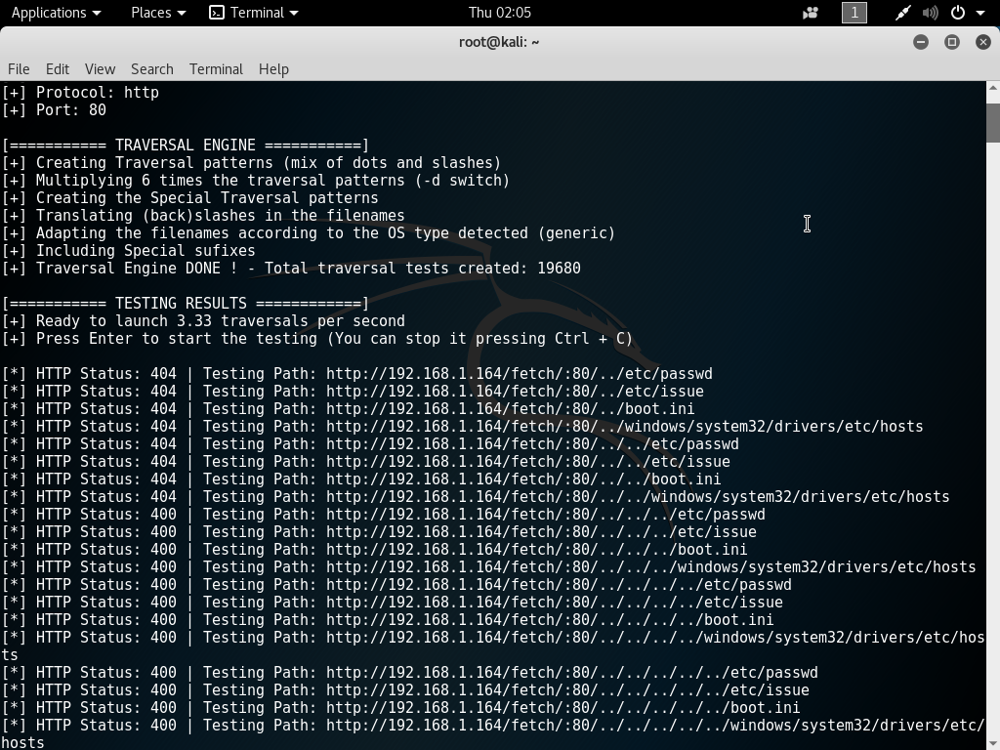

% Penetrations Lab
% David Barnett - 300313764

# Part 1 - Penetration Testing Tools

<!--
 intro to:
  * Equipment interconnection diagram
  * Summart of facilities of 3 pen testing tools
      + Zenmap
      + FileZilla
      + Nessus
  * Note similarities & differences
-->

## Network

Figure 1 shows the structure of the network
used in the first part of the lab.
There are three components used in this network (from left to right),

 * The Bank server,
 * Firewall, and
 * Penetration Tester's machine

The diagram shows that the Penetrator's machine has a configured
firewall between it and the target, bank server.

The bank server was a host to web service and a database.
This was to provide a banking service to clients.

## Tools used

There were three tools used during the first part of the lab.
These were:

 * Zenmap,
 * FileZilla, and
 * Nessus

Each of these tools have different uses throughout the penetration testing.

### Zenmap (nmap)

`Zenmap` is a GUI front end for a network exploration tool `nmap`.
`nmap` is an open source command line tool that is used during the discovery phase
of the penetration testing of the banking system.
This tool was designed to be used for this purpose
The tool provides features that can discover a range of information about
a network and the hosts on it [@pen-test].
One of the features it can discover and map the topology of a network by
pinging hosts and using trace routes to build up the map.
Another feature allows `nmap` to scan the ports of a target host
machine for open ports and relates then to services.
It goes one step further by attempting to finger print the open services
but trying to identify what software is running the service and what version, e.g.
testing port 80 and finds out it is an Apache web server running version
`2.4.27` [@nmap].
`nmap` by itself is very feature rich but lacks the accessibility and
requires the user to parse and understand the output of the commands to
be useful.
`Zenmap` solves this issue by providing a GUI over top of
these features and makes then even more accessible.
This has been achieved by parsing the output of a normal `nmap` command and
displaying it with additional hints, such as colouring and in the case of
the network topology even a map.
With these features the `Zenmap` tool is an accessible reconnaissance tool.

<!--
* recon for other tools to then use
* gives hints at what services could be exploitable
* list the ports of interest that were found
* tried anon access to some services
* finger printed services, e.g. IIS host & version
-->

### FileZilla

`FileZilla` is a GUI FTP client that is used to interact with FTP service.
This is an open source tool that in the penetration lab was used to as
an attack tool to attempt to test and exploit a potential weakness on
the bank server [@pen-test].
This tool was not designed to be used as a part of penetration testing but
is useful as a consequence of FTP being exploitable [@ftpsec].
In this lab it was found via `Zenmap` that the target Bank machine allows
anonymous access. This was tested with `FileZilla` by directly connecting
to the machine via FTP. From experimenting with the connection reading
the files in the FTP directory was allowed, however writing to the server
was not.

Compared to `Zennmap` and `Nessus`the information gained from using this tool is limited.
Using `FileZilla` in this penetration testing allows for testing the FTP service
as a well behaved user.
However, `Nessus` informs the tester of what is possible as a
malicious user.
This shows that `FileZilla` is a good tool for testing for
misconfiguration of FTP services, such as anonymous write access,
but does not reveal deeper vulnerabilities such as the potential of
bounce attacks from a malicious client [@ftpsec].

<!--
 * Used to prod into open anon FTP
 * could not write to disk
 * could read listing
 *
-->

### Nessus

`Nessus` is a commercial tool to scan and report vulnerabilities
in system.
`Nessus` scans for a range of possible vulnerabilities  from checking
for default passwords, misconfiguration, known exploits and more.
This tool is used during the discovery phase to identify common
vulnerabilities in a system [@pen-test][@nessus].
In the lab this tool was used to identify possible vulnerabilities
of the system, a complete scan showed over 40 potential exploits.

`Nessus` shares common functionality with `Zenmap`.
Both of these tools would be used during the discovery phase
but with different aims [@pen-test].
Where `Zenmap` is more focused on identifying open ports and fingerprinting
services `Nessus` expands on this by testing for known vulnerabilities
either by exploits or misconfiguration.
Both of these tools provides reporting back to the user to understand
what has been discovered of the network or a single host.
However, the main draw back of `Nessus` against `Zenmap` is that
it is a commercial product as opposed to an open-source project.

 <!--
 *
 -->

### Dotdotpwn

`dotdotpwn` is a vulnerabilities testing tool that uses fuzzing to discover
directory traversal exploits.
The tool supports fuzzing over HTTP and FTP urls.
It tests for possible urls that would read from an arbitrary path on
the target machine.
For example the HTTP server behind `example.com` might allow or be poorly
configured that a malformed request such as `http://example.com/../server.crt`
would send the private key for the SSL of the server from the parent directory
on the server.
This is a major leakage of private information that could then lend to
handing over passwords stored on the server.
This tool is useful in the discovery phase of a penetration test as 
it givens additional information on possible attack vectors [@pen-test].

Compared to the other tools used in the lab `dotdotpwn` is very domain 
specific to malformed URLs.
Where `Zenmap` is useful for finding more general information about a
target host and some additional fingerprinting if it can.
`Nessus` is similar in regard of find particular exploits of the host but
differ in the range of exploits they seek to detect.
As opposed to all of the other tools `dotdotpwn` would be a good
addition to a set of security integration tests to ensure
future development of the system do not introduce this kind of exploit.

\pagebreak

\pagebreak

# Part 2 - Intrusion Detection

<!--
 * describe use of SNORT
 * explain how the CLI version functions
 * discuss monitoring & reporting facilities of SNORBY
-->

## SNORT

`SNORT` is an open source network intrusion detection system (NIDS).
The objective of `SNORT` is to monitor and warn of detected
attacks or probes from potential attacks.
In this lab `SNORT` was used by the monitoring laptop in the
Bank.
The NIDS function is the main feature of `SNORT` but it also
exposes the key features that enable it, packet sniffing and
packet logging [@snort].
To achieve its NIDS goal `SNORT` sniffs all of the packets
that are received by the host and applies a user defined rule
set to identify the traffic, either as normal or as a possible
attack.
The use of user defined rule sets are a major feature of
`SNORT` and is what enables it to be a great tool to
monitor a system.

## SNORBY

`SNORBY` is an open source web front-end to multiple
intrusion detection system (IDS) [@snorby].
`SNORBY` consumes the logs of IDS and presents them
with a user friendly interface that includes graphs
and summary dashboard.
In the lab this tool was used to easily digest the
information that `SNORT` found via monitoring the network.
From `SNORBY`  providing an easy to use interface of
the IDS data it allows for system administrators to be able
to react faster to possible attacks as it is clearer when
graphs spike then reading and digesting a wall of text from
tools like `SNORT`.
However, this tool looks to be abandoned, as there has been
no recent developments on their public repository and
their domain ( snorby.org ) has lapsed and now serves
domain registration advertising.

`SNORT` and `SNORBY` are not competing tools but are
supplementary to each other.
This is because `SNORT` is designed to be a configurable NIDS
that outputs a large log of what it has detected during its
monitoring of the network.
`SNORBY` then supplements this by consuming the log of what
have been monitored and presents this to the administrators
in an easy to digest format of graphs and summary statistics.

## Fail2Ban

`Fail2Ban` is another open-source intrusion detection system
that focuses on preventing brute force attacks [@fail2ban].
This is achieved by monitoring logs of applications, such
as apache web server, sshd and more to identify remote
hosts that are attempting to brute force passwords or exploits.
To prevent further attempts the IP address is then added to
a blacklist on the host firewall to drop all requests from
untrusted user.
However, this can be by-passed with a distributed effort
to brute force a password. This is due to `Fail2Ban` focuses
on a single host attempting too many times and cannot recognise
a distributed attempt and has no means to prevent it.

`Fail2Ban` has the same overall goal as `SNORT` and `SNORBY` of
detecting possible intrusions, but the method to achieve this
is vastly different.
For `Fail2Ban` it achieves this goal by detecting
a possible attacker and then blocking them via the firewall.
While, `SNORT` monitors for possible attack that the user
has defined and `SNORBY` displays the findings of the monitoring.

## Identified Risks

During the lab a range of potential security risks
were identified. Some of these risks are exploitable
from a remote host.
These include:

 * the anonymous access to the FTP service,
 * MySQL server port open across the firewall,
 * SMB/CIFS ports open across the firewall, and
 * MS-RPC port open across the firewall.

### Anonymous FTP Access

The anonymous access to the FTP service opens the
risk of being used in a port bounce attack [@ftpsec].
This attack abuses the FTP protocol to send a file to
a target machine.
The Bank can mitigate this issue in multiple ways.
If the FTP service is designed to be local to within the
business the FTP service itself could be configured to only
accept connections from inside the same network or subnet.
Another approach would be to configure the firewall to reject
all attempts for external hosts connecting to the FTP service.
These configuration can be managed by the system administrators
by documenting the changes and the reasons why, or implement
the changes with a configuration-as-code package such as Puppet.
If the FTP service is suppose to be used publicly,
the FTP service could be patched or choose a
server implementation that supports the prevention of
sending files to hosts other than the connected host.
This can then be maintained by the system administrators
via documentation of the reasons why a particular patch
was applied or server was chosen.
The use of a patch is less maintainable as it requires
additional effort to update the service as it would require
more testing after it has been applied.

### MySQL

Another potential risk is exposing the MySQL port over the
firewall.
This allows for the risk of an attacker brute forcing the
password or acquiring it somehow and having access to the
databases.
There are some methods to mitigate this risk.
One would be to configure the MySQL service to only accept
connections from the local network or the current subnet.
This would prevent direct access from a remote attacker.
Another method would be to block external connections
to MySQL by configuring the firewall to block it.
These can be maintained by the system administrators through
documenting the configuration used for the services
and by implementing and applying them via tools such as
Puppet or Chef to ensure they are set.

However, both of these options assume that the Bank does
not allow for external uses of the MySQL database.
If the Bank did want this a possible mitigation would be
to use a tool like `Fail2Ban` to prevent brute force attacks
on default users like `mysql` or leaked user names.
This would mitigate brute force attacks from a single host
but would not
help to prevent a distributed brute force attack or a
user with stolen credentials outside of
the network accessing the database.
A possible solution would be to configure the service to use
a two factor login for MySQL.
The maintenance for this solution is a lot heavier than
blocking external users, as it requires the configuration and
maintained of an additional local service.

### SMB / CIFS and MS-RPC Ports open

Allowing SMB/CIFS and MS-RPC ports to be open to the internet is
a security risk.
The risk comes from the potential of having an exploit
in the service backing the port.
In case of the SMB server on Windows,
it recently was exploited in the high profile
WannaCry attack [@wannacry].
MS-RPC is very similar to the SMB/CIFS service in this 
regard but control services such as remote shutdown and more.

To mitigate this risk the system administrators can
configure their firewalls to not allow external
hosts accessing the service.
However, if the business requires this access externally
the administrators should regularly patch their servers to
keep up to date with latest fixes of possible exploits.
An alternative to this would be to make external users 
of the service first connect via VPN's and using the service
via the VPN.
This would ensure that only authorized individuals could access
the service externally.
However, this incurs the additional maintenance for the
administrators as they will need to manage the keys for the
VPN and maintain the service.
Those could be managed by tooling that associates keys
with users via package managers or a database.

<!--
 * Identify remote services in operation
   + should be 4 of them
 * recommend secure methods of operation
   + either recommend to shutdown or,
   + hot to secure them
 * explain how the systems staff will carried out:
   + maintenance
   + patches
   + updates
   + new developments are installed for clients
   + how Cloud Services will operate in practice
-->

\pagebreak

# Part 3 - Interception of HTTPS Traffic

## How was HTTPS intercepted

<!-- How & why it works -->

To intercept the HTTPS traffic from a client multiple
requirements are to be met.
One of these is having an network topology setup to allow
for a man-in-the-middle (MITM) attack, either via
ARP spoofing or DHCP control [@dhcpspoof].
For this lab the network was laid out as shown in figure 4.
This shows the user is connecting via a wireless connection
to the hub and from there the MITM and the Bank server are connected to it.

The attacker server is running Mallory, an interceptor engine
application, which also hosts a rouge DHCP server to
setup a MITM between the mobile user and the bank server.
This is achieved by the DHCP server is configured by
Mallory to resolve requests for the bank server from
the wireless AP to go to the MITM machine instead of the
indented host.
In this case the Mallory engine has been configured to
forward the requests to their intended host after the requests
have been processed.

After the request has been redirected to the MITM
the Mallory engine can intercept and modify the TCP
stream.
For example, the requested page by the mobile user could
be modified on the fly from the index page to the about page.

To intercept the HTTPS traffic from the mobile user
Mallory generates an SSL cert on the fly to use
between it and the user.
To the mobile user a warning about the SSL certificate is
self signed or not signed by a trusted root certificate.
In this lab the mobile user accepted this warning and
trusted this certificate.
With the mobile user accepting this certificate a
secure HTTPS connection between the mobile user
and the MITM is established [@jarmoc2012ssl] [@gangan2015review].
From there the MITM will then make a separate secure connection
to the Bank server to forward the request from the user.
During the forwarding between these two connections the
MITM machine has the opportunity to inspect the traffic.
This is how the HTTPS interception occurred during this lab.

This interception shows the vulnerability in HTTPS
is that the user assumes it is encrypted to
the service machine.
This is not an vulnerability of the HTTPS protocol but of 
how the assumption of end-to-end connections can
be exploited.

A possible extension to this attack would be to make the
generated certificate look trusted.
This could be achieved by either installing a root certificate to the victim's 
machine, or by acquiring leaked SSL certificates from
the service.
This would make the end user unaware, no SSL prompts and the
browser reports it secure, that they are not
connected to the actual service but a MITM.

## How to prevent HTTPS interception

To prevent this interception the first part to
stop is the underpinning MITM attack.
In this lab this in the form of DHCP control,
this could be mitigated with secure DHCP [@komori2002secure].
This would prevent a rouge DHCP server in the network
from redirecting traffic to the MITM host and
would then prevent the entire interception attack.
However, this would not help in the case of a user
being connected via a network completely controlled by
the attacker, such as a public WiFi that the attacker is
hosting or spoofing such as Wellington City's free WiFi 
`cbdfree`.

In the case of a network controlled completely by an attacker
the user would need to strengthen its rules of accepting
SSL certificates [@jarmoc2012ssl].
This could be enforced in a range of methods.
One such strengthening would be to not trust certificates
recently created as tool such as Mallory will generate
the certificates on the fly during the attack.
However, this could also impact legitimate use cases as
the rise of free SSL certificates from vendors such as
LetsEncrypt has brought upon some administrators refreshing
certificates as frequent as once a week.
Another strengthening is that web browsers do not allow
for the use of self-signed certificates outside of the
local domain, including not allowing users to allow an
exception without extra informed steps. 
This would prevent an unsuspecting user to add the exception
easily and allow the attack.
Web browsers can enforce this more strongly in the current
web as there is no longer a cost barrier to getting trusted
SSL certificates thanks to services such as LetsEncrypt.

However, this is all for naught if the attacker
has installed root certificate onto the target machine.
In recent times Lenovo laptops had an untrustworthy
certificate authority installed by default.
As well as a free SSL certificate issued false certificates
for well known website, Github.com.
To mitigate this Chrome and Firefox has started
to blacklist some certificate authorities and showing
the error of untrusted certificate authority [@distrust].

<!-- How to prevent it, example in practice -->

## Additional method to intercept HTTPS

<!-- Another method to intercept HTTPS -->
Another method to intercept HTTPS traffic is to exploit
implementation details of SSL certificate verification [@sslstrip].
The main target of this attack is that previously 
the implementations did not check if the certificate
in the chain had the right permissions to sign the child
certificate in the chain.
For example you obtain a legitimate SSL certificate from a
vendor and then use that certificate to sign your own
spoof certificate for a site like KiwiBank.
This ends up with a site certificate signing another
site certificate.
This exploit relies on the fact that implementation of
SSL certificate verification only test the chain of 
trust for valid signatures and if the leaf node matches
the domain connecting to.
This leaves open the possibility that a certificate signed
another certificate even though it did not have the rights
to do so.
From the client perspective the spoof certificate will
be validated as correct and proceed to use it.
This allows an attacker to make a phishing site with a valid
the SSL certificate or use it in conjunction with the MITM
attack as used in the lab.
With this spoofing of SSL certificates HTTPS is rendered useless
and the traffic to the server can be intercepted.
However, this attack has been fixed as implementations of
SSL certificate validation has been updated to prevent this
by checking if the signing certificate can actually sign the
child certificate.

<!--
  Intercept encrypted traffic
  Provide summary of:
   * how the intersception works
   * how it is  possible to extract personal data from HTTPS
  (NOTE: ONLY IT ENGR side, not legal/ethics of it)
-->

\pagebreak

# Bibliography
