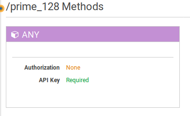
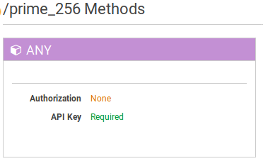
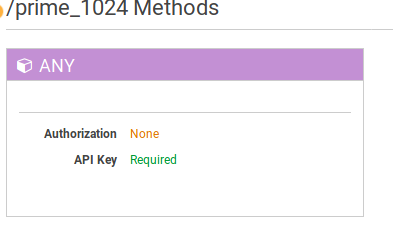

% Project 2 - AWS Lambda - NWEN406
% David Barnett (300313764)

# Setup and Tests

The test event used was

```json
{
  "queryStringParameters": {
    "max": 1000000,
    "loops": 1
  }
}
```

## 128MiB Test

```json
{
  "body": "{\"durationSeconds\": 6.01017189026, \"max\": 1000000, \"loops\": 1}",
  "headers": {
    "Content-Type": "application/json"
  },
  "statusCode": 200
}
```

```
START RequestId: a2fc6e92-a548-11e7-ae92-01f7a468452c Version: $LATEST
looping 1 time(s)
Highest 3 primes: 999983, 999979, 999961
END RequestId: a2fc6e92-a548-11e7-ae92-01f7a468452c
REPORT RequestId: a2fc6e92-a548-11e7-ae92-01f7a468452c
Duration: 6067.78 ms	Billed Duration: 6100 ms 	Memory Size: 128 MB	Max Memory Used: 68 MB	
```

Cost: \$0.000000208 per 100ms

## 256MiB Test

```json
{
  "body": "{\"durationSeconds\": 2.77592682838, \"max\": 1000000, \"loops\": 1}",
  "headers": {
    "Content-Type": "application/json"
  },
  "statusCode": 200
}
```

```
TART RequestId: 70dee24d-a549-11e7-b183-09e2f64b10a8 Version: $LATEST
looping 1 time(s)
Highest 3 primes: 999983, 999979, 999961
END RequestId: 70dee24d-a549-11e7-b183-09e2f64b10a8
REPORT RequestId: 70dee24d-a549-11e7-b183-09e2f64b10a8
Duration: 2777.49 ms	Billed Duration: 2800 ms 	Memory Size: 256 MB	Max Memory Used: 68 MB	
```

Cost: \$0.000000417 per 100ms

## 512MiB Test

```json
{
  "body": "{\"durationSeconds\": 1.40210008621, \"max\": 1000000, \"loops\": 1}",
  "headers": {
    "Content-Type": "application/json"
  },
  "statusCode": 200
}
```

```
START RequestId: d825c987-a549-11e7-9e76-87618d29cdac Version: $LATEST
looping 1 time(s)
Highest 3 primes: 999983, 999979, 999961
END RequestId: d825c987-a549-11e7-9e76-87618d29cdac
REPORT RequestId: d825c987-a549-11e7-9e76-87618d29cdac
Duration: 1419.71 ms	Billed Duration: 1500 ms 	Memory Size: 512 MB	Max Memory Used: 68 MB
```

Cost: \$0.000000834 per 100ms

## 1024MiB Test

```json
{
  "body": "{\"durationSeconds\": 0.639266014099, \"max\": 1000000, \"loops\": 1}",
  "headers": {
    "Content-Type": "application/json"
  },
  "statusCode": 200
}
```

```
START RequestId: 2e165d94-a54a-11e7-8dca-07e15a2c10f0 Version: $LATEST
looping 1 time(s)
Highest 3 primes: 999983, 999979, 999961
END RequestId: 2e165d94-a54a-11e7-8dca-07e15a2c10f0
REPORT RequestId: 2e165d94-a54a-11e7-8dca-07e15a2c10f0
Duration: 640.79 ms	Billed Duration: 700 ms 	Memory Size: 1024 MB	Max Memory Used: 68 MB	
```

Cost: \$0.000001667 per 100ms

## Analysis

Test    | Duration (ms) |  Difference (ms) | Cost (\$ 6.s.f)
--------+---------------+------------------|---------------
128MiB  | 6067.78       | -                | \$0.001269
256MiB  | 2777.49       | 3290.29 (54.23%) | \$0.001168
512MiB  | 1419.71       | 1357.78 (48.89%) | \$0.001251
1024MiB | 640.79        | 778.92 (54.86%)  | \$0.001167

From the results the speed up between memory and duration is roughly a linear increase.
This is shown by each time the memory size is doubled the difference in duration is 
roughly a half in duration.
The logs reveal that only 68MiB of memory is used in each test which does not explain
the linear increases with increasing the memory size.
This also shows that the bottleneck is not in the memory usage but in compute.
The AWS Lambda documentation reveals that the allocation of CPU's is proportional
to the memory allocated. This means that by increasing the memory the amount of
compute for the function also increases.

The cost of running each lambda does not share the same linear relation.
This is due to the prices scale with the memory allocated.
Though some of the tests did cost less than the others due to
a decrease in the duration of the test by over half which counterbalanced
the price doubling.
The 256MiB and 512MiB are two instances of this occurring during testing
and they also had over 50% difference with the previous test.

# Automated requests

## How to run it

The tool created to automate the requests and log the results is `lambda_hit`.
It is a tool written in rust and uses a simple HTTP request library to
retrieve the result from the API and parses them.
The tool provides logging of:

 * the reported duration from the response,
 * individual timings of each requests
 * and total time of all requests.

This is achieved through a simple command line interface, below
is the output of the tools `--help` flag.
The output of the tool produces a CSV file.

To run the tool it first needs to be built,

 * `cargo build --release`[^1]

To run the tool use either:

 * `cargo run --release -- $URL -t 100` or,
 * `./target/release/lambda_hit $URL -t 100`

Where `$URL` is replaced with your lambda url with all the attributes added,
e.g. `lambda.url/prime_128?max=10000&loops=1`

[^1]: see *[rustup.sh](https://rustup.rs/)* for instructions to install `rustc` and `cargo`

## Experiment

The experiment was run with a script to wrap around the `lambda_hit` tool to
iterate through the configuration options such as lambda functions and loop counts.
It also handles the creation of summary statistics with the tool `clistats`[^2]
The script has been included as `experiment.sh`.

[^2]: Which can be built from [https://github.com/dpmcmlxxvi/clistats](https://github.com/dpmcmlxxvi/clistats)

### Results

Summary statistics of 100 runs per configuration.

Memory | # of loops |    Minimum |      Mean   | Maximum      | Stdev
-------+------------+------------+-------------+--------------+----------
128    | 2          | 15.392065  | 58.422863   | 279.798031   | 27.872589
128    | 3          | 69.567919  | 100.666213  | 151.124954   | 18.615950
128    | 4          | 114.506006 | 154.545174  | 233.120918   | 19.967856
128    | 5          | 158.253908 | 200.522909  | 254.385948   | 19.992054
256    | 2          | 7.298946   | 22.109699   | 122.258902   | 15.553824
256    | 3          | 27.133942  | 43.210709   | 63.193083    | 9.538246
256    | 4          | 50.564051  | 68.327770   | 98.928928    | 11.344579
256    | 5          | 70.148230  | 94.248595   | 215.234995   | 15.892146
512    | 2          | 7.257938   | 11.872973   | 39.644957    | 6.675598
512    | 3          | 10.884047  | 17.634885   | 39.284945    | 7.187114
512    | 4          | 14.472008  | 28.659892   | 82.782984    | 9.735647
512    | 5          | 30.083895  | 39.904850   | 58.692932    | 7.546977
1024   | 2          | 7.310867   | 8.568983    | 36.988974    | 3.969374
1024   | 3          | 10.901213  | 11.974785   | 23.303986    | 2.667912
1024   | 4          | 14.537096  | 18.143349   | 51.027060    | 5.506486
1024   | 5          | 18.132210  | 22.757885   | 38.362026    | 5.202155

The AWS Console reports that none of the requests were throttled during the
experiment.

## Analysis

On average the application scales linearly with the increase of memory
allocated (and thus CPU).
The summary statistics also show that in general that each configuration
is relatively stable in execution time with the standard deviation generally
within 10% of the mean.
This shows that on the small scale tested, of roughly hundreds of requests per minute,
the performance is consistent with some deviations.
The summary statistics also show that with a doubling in price with doubling
the memory allocated does give the equivalent reduction of average execution time.

For AWS Lambda throttling occurs when total concurrent executions
across all functions within a region  exceeded 1000 running functions[^3].
For example if all 16 configurations of the previous experiment were ran all at
once concurrently the requests will start to be throttled.
This experiment will not reach that as each request is completed in sequence.
Under the hood of Lambda the containers used to service the request would
most likely be reused so only a small number of Lambda instances need to run at
once.

[^3]: From [AWS Documentation](http://docs.aws.amazon.com/lambda/latest/dg/concurrent-executions.html#concurrent-execution-safety-limit) and the [Lambda FAQ](https://aws.amazon.com/lambda/faqs/)

The variation across the same work load can be attributed to its environment.
Since the underlying AWS Lambda servers are shared resource with other AWS
customers it is not guaranteed that your lambda execution will get all of the
CPU time. This means your lambda will be sharing execution time with other
customers which adds some randomness to the execution time due to
attentionally other customers could hog the CPU time.
However, your lambda function will still get CPU time due to AWS's load
balancing to prevent starvation.

# Concurrent automated requests

To allow concurrent requests the `lambda_hit` tool has been modified to use
asynchronous requests.
All of the requests are performed at the same time 

## Results


Memory | # of loops |    Minimum |      Mean   | Maximum      | Stdev
-------+------------+------------+-------------+--------------+----------
128    | 2          | 1.661949   | 212.350297  | 394.132853   | 89.367903
128    | 3          | 1.518879   | 180.980616  | 257.611990   | 41.544646
128    | 4          | 5.356150   | 391.620035  | 529.399872   | 92.257410
128    | 5          | 7.680950   | 347.747970  | 466.483116   | 65.218964
256    | 2          | 1.754990   | 116.730609  | 214.514017   | 50.953489
256    | 3          | 1.208038   | 93.453712   | 136.559010   | 27.153878
256    | 4          | 2.748919   | 194.646206  | 294.570923   | 66.549796
256    | 5          | 2.195988   | 176.454201  | 240.988970   | 32.295136
512    | 2          | 6.538868   | 37.938838   | 96.696138    | 24.585382
512    | 3          | 9.924173   | 34.365878   | 60.138941    | 14.406081
512    | 4          | 7.271042   | 77.752428   | 136.448145   | 33.147134
512    | 5          | 0.129194   | 64.372025   | 103.466034   | 18.008806
1024   | 2          | 6.319046   | 17.367482   | 50.689936    | 12.318000
1024   | 3          | 9.603977   | 15.892920   | 52.386045    | 8.853962
1024   | 4          | 3.154030   | 35.211678   | 67.680120    | 15.763039
1024   | 5          | 6.420126   | 33.477459   | 60.920000    | 12.210067

## Analysis

The asynchronous requests have a similar pattern to the synchronous 
experiment with doubling memory halves the execution time on average.
However, this result shows more variation during the test.
This would be due to the bulk number of requests at the API at once.
Since the previous experiment used sequential requests that could re-use
previous lambda requests the chance of getting the same machine to service
multiple requests is greater.
However, with the bulk requests each request will get its own lambda instance
to service the request which would lead to greater variance as shown in the
results.

# API Key authorisation

Figures 1 to 4 are screen shots of the API endpoints with the requirement of
having API keys.

To test if the API key gate works `lambda_hit` tool tried without modification
and received the following response:

```json
{"message":"Forbidden"}
```

By adding the header `x-api-key: $API_KEY` to the HTTP request the response
displays as before. For example using `curl` this would look like:

```sh
# attempt without API key
> curl https://5de7xws1p8.execute-api.us-west-2.amazonaws.com/prod/prime_1024\?max\=1000\&loops\=1 
{"message": "Internal server error"}

# attempt with API key
> curl https://5de7xws1p8.execute-api.us-west-2.amazonaws.com/prod/prime_1024\?max\=1000\&loops\=1 
  -H 'x-api-key: $API_KEY'
{"durationSeconds": 0.000591039657593, "max": 1000, "loops": 1}
```








\pagebreak

# Challenge

Website: [http://ec2-52-38-107-69.us-west-2.compute.amazonaws.com/](http://ec2-52-38-107-69.us-west-2.compute.amazonaws.com/)

The site uses Github OAuth to authenticate the user.
This is to prevent a drive by usage of the lambda functions.
The backing site is a NodeJS application using [passportjs](http://passportjs.org) to
handle the finer points of OAuth to GitHub.
This establishes an authenticated session for the user to use the API.

The lambda API is hidden behind the `/compute` api of the site.
To use this endpoint the request must be authenticated with the cookies
from the GitHub login.
The parameters for the API mirrors the Lambda's API apart from the inclusion of 
a `size` parameter.
This is used to hint at which lambda function to use, be it small (128MiB), medium (256MiB), large (512MiB) or 
extra large (1024MiB).

The source code for this site is in `site.zip`.
