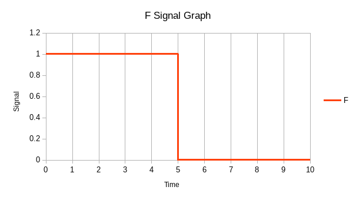

% NWEN242 Homework Assignment 2
% David Barnett ID: 300313764

### Question 1 {#Q1}

#### Part A

Yes

#### Part B

No

### Question 2 {#Q2}

```mips
    addi $t0, $zero, 0 # i = 0
ILOOP:
    slt $t3,$s0,$t0
    beq $t3, $zero, ILOOPEND # i < a
    addi $t1, $zero, 0 # i = 0
JLOOP:
    slt $t3,$s1,$t1
    beq $t3, $zero, JLOOPEND # j < b

    add $t3, $t1, $t2 # $t3 = i + j
    sll $t4, $t2, 2   # j * 4
    add $t4, $s2, $t4 # $t4 = &D[j * 4]
    sw  $t3, 0($t4)   # D[j * 4] = $t3

    addi $t1, $t1, 1 # j++
    j JLOOP
JLOOPEND:

    j ILOOP
ILOOPEND:
```

\pagebreak

### Question 3 {#Q3}

Assuming `a = $a0` `b = $a1` `c = $a2` `d = $a3`

```mips
func_f:
    addi $sp, $sp, -8
    sw $ra, 0($sp)
    sw $a0, 4($sp)
    move $a1, $a2 # set up argument $a0 = a $a1 = c
    jal FUNC # call func
    # restore variable a and return pointer
    lw $ra, 0($sp)
    lw $t0, 4($sp)
    addi $sp, $sp, 8 # restore stack pointer
    add $r0, $r0, $t0 # make return value of a+func()
    jr $ra # return with result in $r0
```

### Question 4 {#Q4}

The value of the word at address `0x10000000` is `0x11223344` and the
value of the word at `0x10000010` is `0x11???????` with the ?'s being undefined

\pagebreak

### Question 5 {#Q5}

Inputs are `A`, `B`, `C` and `D`. Output is `O`

+---+---+---+---+---+
| A | B | C | D | O |
+===+===+===+===+===+
| 0 | 0 | 0 | 0 | 0 |
+---+---+---+---+---+
| 1 | 0 | 0 | 0 | 1 |
+---+---+---+---+---+
| 0 | 1 | 0 | 0 | 1 |
+---+---+---+---+---+
| 1 | 1 | 0 | 0 | 0 |
+---+---+---+---+---+
| 0 | 0 | 1 | 0 | 1 |
+---+---+---+---+---+
| 1 | 0 | 1 | 0 | 0 |
+---+---+---+---+---+
| 0 | 1 | 1 | 0 | 0 |
+---+---+---+---+---+
| 1 | 1 | 1 | 0 | 1 |
+---+---+---+---+---+
| 0 | 0 | 0 | 1 | 1 |
+---+---+---+---+---+
| 1 | 0 | 0 | 1 | 0 |
+---+---+---+---+---+
| 0 | 1 | 0 | 1 | 0 |
+---+---+---+---+---+
| 1 | 1 | 0 | 1 | 1 |
+---+---+---+---+---+
| 0 | 0 | 1 | 1 | 0 |
+---+---+---+---+---+
| 1 | 0 | 1 | 1 | 1 |
+---+---+---+---+---+
| 0 | 1 | 1 | 1 | 1 |
+---+---+---+---+---+
| 1 | 1 | 1 | 1 | 0 |
+---+---+---+---+---+

### Question 6 {#Q6}

$$
(A * \bar{B} * \bar{C} * \bar{D}) +
$$$$
(\bar{A} * B * \bar{C} * \bar{D}) +
$$$$
(\bar{A} * \bar{B} * C * \bar{D}) +
$$$$
(\bar{A} * \bar{B} * \bar{C} * D) +
$$$$
(A * B * C * \bar{D}) +
$$$$
(A * B * \bar{C} * D) +
$$$$
(A * \bar{B} * C * D) +
$$$$
(\bar{A} * B * C * D)
$$

\pagebreak

### Question 7 {#Q7}

Graph have T=0 with the initial values



