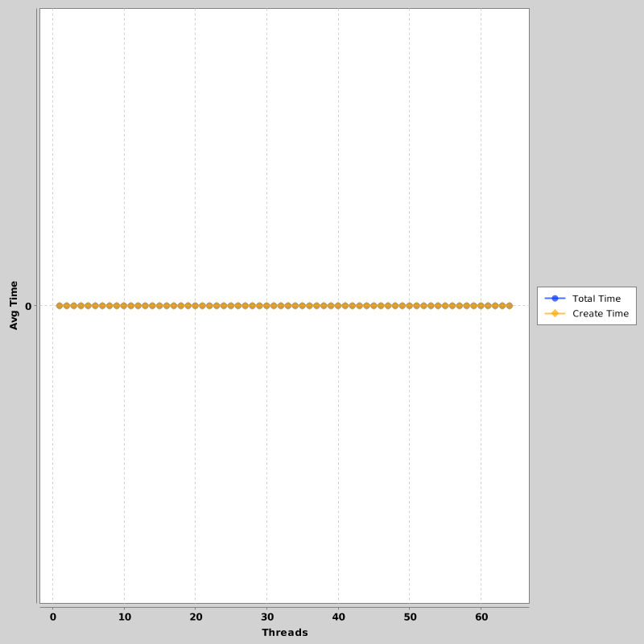
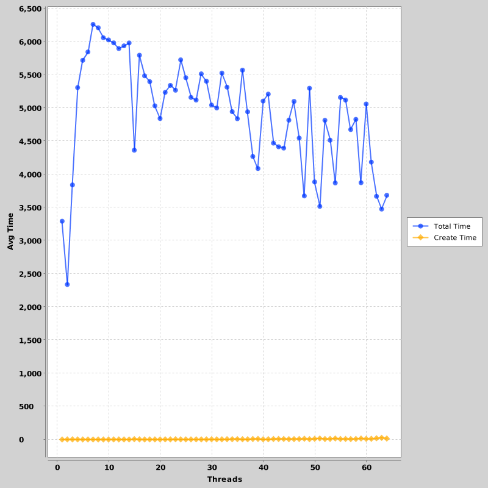
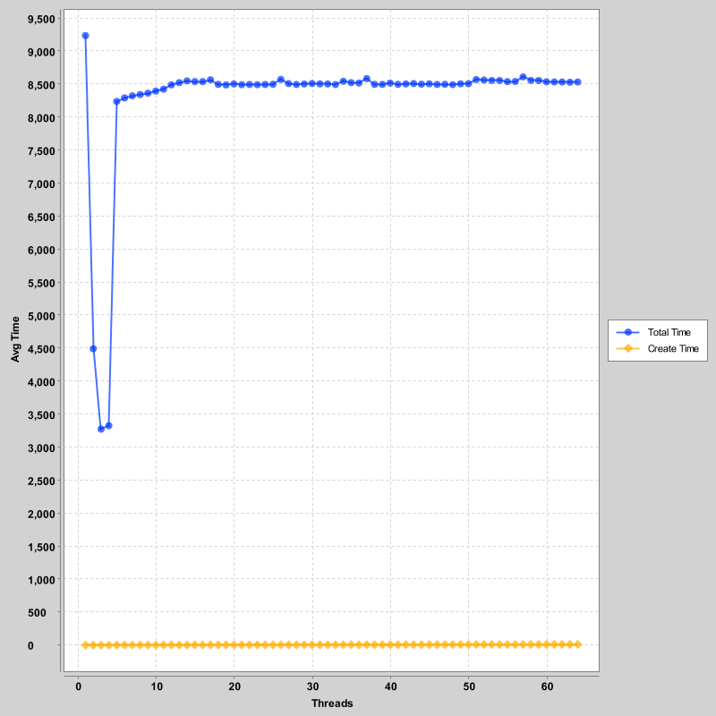
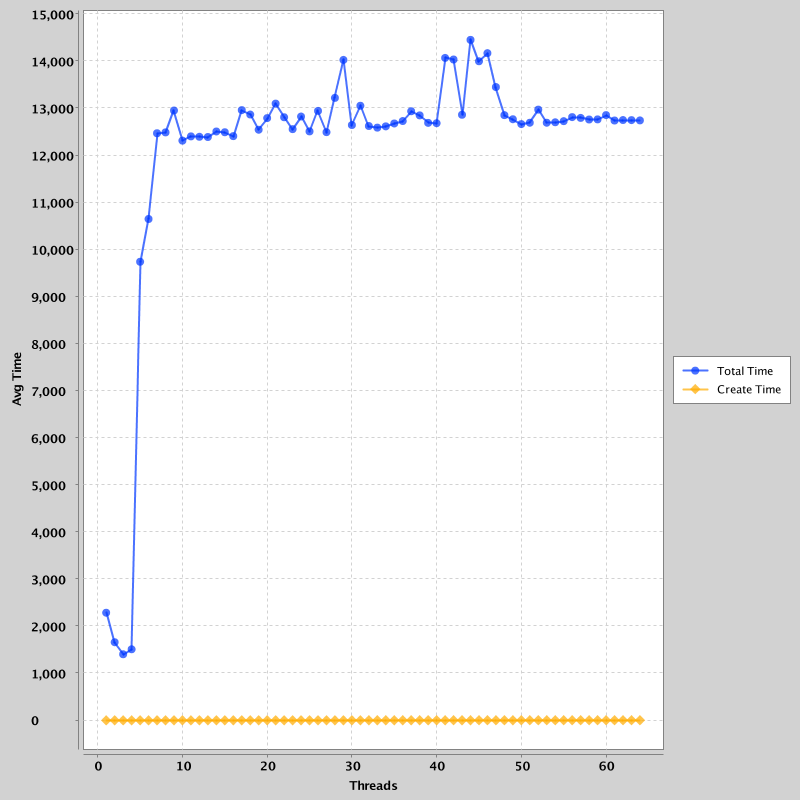
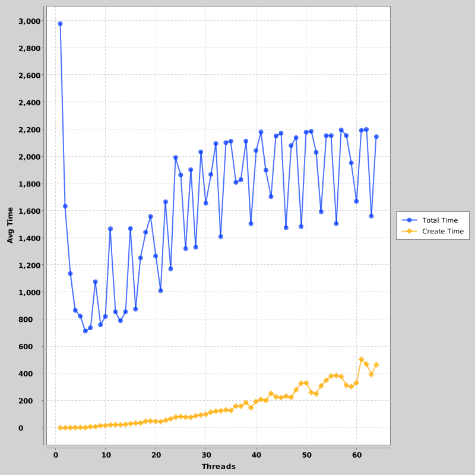
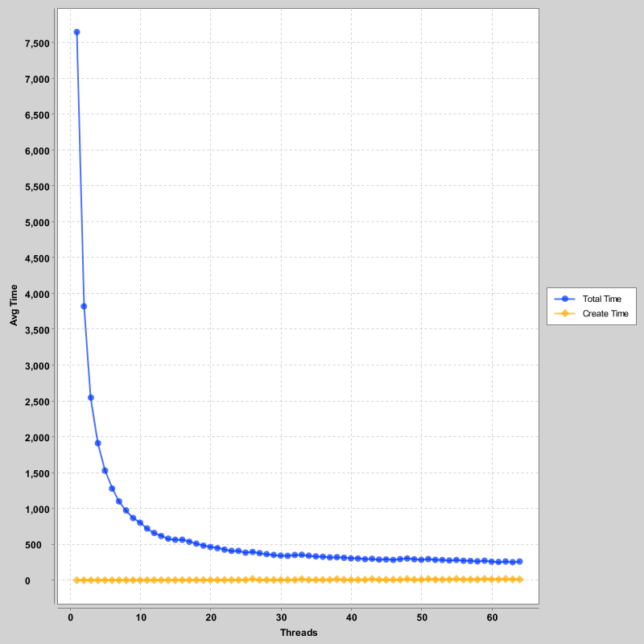
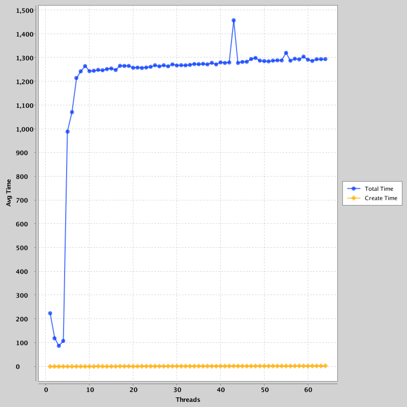
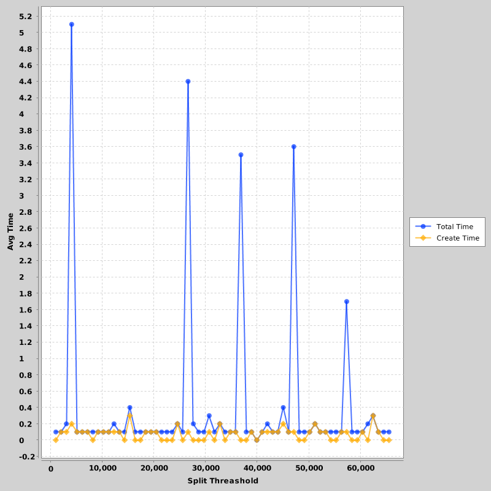

% NWEN303 - Assignment 1
% David Barnett (300313764)

# 1. Synchronisation 
<!--
K and finished are global / shared variables
-->

## A)
<!--
race condition
where the output is dependent on the sequence or timing of other uncontrollable events
- race:
    k is overwritten by each thread
    a loop may start while found is being assigned
    multiple threads could find a result at the same time

Types:
- check-then-act
- read-modify-write
-->

A race condition is when the result of an operation is dependent on 
sequence of execution of two or more threads. Race conditions can come in many types
and may break the correctness of the operation. The given algorithm to concurrently 
find were `f(x)` equals 0 has a few race conditions.

One race condition results from the algorithm shares the variable `k` between all threads
which is set to be the starting point for the thread to find the answer. The race condition
comes from the series of values actually checked is dependent on which is the last thread
to start and set `k` to be its starting point and every other thread is then set to be this
value as well. This will cause the algorithm to only check `1/N` of the search space it was
suppose to. 

There is another race condition that results from having `k` shared between all the threads.
This could occur when one thread finds a value of `k` and in the time between starting the
execution of the check of `f(k) == 0` and printing the `k` another thread could modify
`k` due to that thread failed its check for `f(k) == 0` because another thread updating
`k` in between these checks. This race condition is a combination of check-then-act and 
read-modify-write races. This would cause incorrect results from the algorithm.

A result of having the `found` boolean being shared a race condition is introduced.
This race condition is cause when a thread has  just found a correct value of `k` and
is about to update the `found` variable but another thread could start another loop
in between the time of find the result. This would cause an extra loop to be executed,
which in this context is not expensive and is a reasonable cost. However if in that extra
loop the thread finds another solution it will result in more than 1 result for the algorithm
which is not desired. 

## B)
<!--
modify to avoid reace condition,
correct without race nor deadlocks 

-   make k to be a thread local variable
-->

There are a few modifications I would make to the given algorithm to avoid the race
conditions currently present. 

The most major modification would be to make `k` a thread local variable.
This will prevent each thread from over writing each others starting values or current values
between checking `f(k) == 0` and printing `k`. 
This would greatly increase the correctness of the algorithm. 

Depending the on the acceptability of the algorithm finding more than 1 solution the `found` 
might need to be locked. Given that only 1 solution is acceptable the `found` variable will
need to synchronise in the success branch of `f(k) == 0` and preform an extra check for if
`found` is true before printing the result to prevent a check-then-act race condition.
This will result in a chance of an extra loop to be executed if the loop starts just before the
`found` variable is updated but to prevent this it would require locking found as it is being
read which would hurt the performance of the algorithm. 

## C)
<!--
fairness, how does B) depend on fairness assumption
- same amount of process time
- fair share of processing time between threads
- pusdeo stravation
-->

Fairness in concurrency is when each threads is an even share
of the available resources such as CPU time, memory or CPU cache.
The correctness of my algorithm in part B) relies on each thread being
given CPU time to progress. In an unfair situation on thread could
be given CPU time sparingly and end up being behind the other threads
as they progress further in their allocated work. This could cause the
correctness of the algorithm to suffer if one thread that would eventually
find the solution is not run.

## D)
<!--
how could algorithm from B) could be modified to work
with absence of fairness. How does it impact performace
-->

In the absence of fairness the algorithm from B) could be modified to remove this
assumption. One possible way of doing this is by having a shared queue of available
values to be checked. Instead of being given a starting value to increment each thread
would just dequeue a value to check from the shared work queue. This would result in 
some loss of performance as threads might have to wait on a lock on the queue when getting
values from it, depending on the implementation of the queue.

# 2. Measuring Array Sum

Each experiment was preformed on three systems: an 8 core desktop computer which 
has a clock speed of 4Ghz, a 4 core laptop with a clock speed of around 2.1Ghz
and Lighthouse with 64 cores with a clock speed of 1.1Ghz. The Java versions were
consistent expect for Lighthouse being only Java 7 while all other machines were
the latest Java 8. All measurements of time are recorded in milliseconds. 
Each data point is an average of 10 runs of the experiment.

## Sequential Summing

The first experiments is a base line of summing elements on a single thread.
The range of sizes uses where 100 to 10 million incrementing by a multiple of
10 each step. The results for each of the array sizes where very similar so
only Figure 1 showing the time spent on summing 10 million elements is included.
There are many factored that would of contributed to these consistent sub-millisecond 
results could be the absence of having to switch between threads with other
threads or processes. Another possible reason could be that the Java virtual
machine identified the tight loop and applied just-in-time compiling to
increase the performance of the loop to near native speeds coupled with the
benefits of the temporal cache locality of summing arrays with such a simple
operation as addition. 

## Global Variable

The next part of the experiment is to show the affect of concurrently summing
the array with different methods using different numbers of threads and array
sizes. For this part the concurrent method used is to sum from each thread into
a shared synchronised global variable and yield the thread after each addition.

Each machine that ran this experiment had large variations between each others
in their results expect for the relatively low cost of initialising the threads
at the start of each run. Lighthouse and the 4 Core laptop both showed plateauing 
after around 4 threads were used. For the laptop this would make sense as this
is the point where the number of threads for the program will be greater than
the number of physical cores to compute the operations. Expect for Lighthouse
with its 64 threads this does not make much sense and I presume it is a
*feature* of the operation system's scheduler to fairly distribute cpu time.
A interesting point in the 4 core laptop is the amount of time taken is a
magnitude greater than the other machines and while running the tests I
recorded 80% of cpu time was spent on kernel tasks, I presume this to be
resulting from page faults as the process was making an excess number of
context switches between threads and the system resulted over a million page
faults by the process by the end of the experiment. This is most likely caused
by the OS of the laptop stored the large array to page file for an unknown
reason, even though it had enough RAM storage for the array.

The affect of the yield as a part of the method to calculate this causes the
thread to stop and go to the back of the queue for CPU time and is platform
dependent on how this will affect results. The amount of time to create the
threads had an upwards trend with the number of threads needed to be created as
expected but it was relatively very small. A side-affect of using a synchronised shared
global variable to be summed to is each thread must wait till the last thread to start updating it
has completed so a considerable amount of time is waiting for another thread to finish as well as
then yielding its spot to be currently executed and moved to the back of the cpu time queue hurts and
the associated context switching between threads is costly.

## Local Variable

The other method used to test summing large arrays concurrently was to use a local variable 
instead of a shared variable. So this makes the method be give each thread a range in the array
and make a local sum of its elements and the main thread then summing up the results of the threads
after they join back into the main thread, to be consistent after each element is summed the thread is yielded as
well.

In this experiment each of the machines behaved differently to each other. However the 4 core laptop behaved
similarly to how it was in the global variable experiment and the same page fault issue was observed again which
explains the same shape of the graph. Expect the average time was a tenth of the global variable variant which can be attributed
to not having to be locked waiting for the global variable to sum a value.
The results observed from Lighthouse and its 64 threads shows a speed up with every thread added.
This is likely caused by each thread getting one physical CPU to compute and no interdependence between
threads on who has the lock on the global sum variable. A similar trend can be seen in the 8 core PC but
quickly loses it after the number of threads exceeds the number of CPU cores in the machine. In laptop and
Lighthouse runs the cost of starting the threads were relatively negligible, while the cost of making threads 
on the 8 core PC shows an increasing trend past 8 threads. This could be caused by the lower overall time to
sum the array is lower due to clock speed differences so the change in time to create threads becomes more significant
with the number of threads used.

Overall the usage of the local variable significantly increases the performance of the summation when compared to 
the use of global variable. This generally comes down to not needing to synchronise between all the threads to access
the shared global variable.

\pagebreak

# 3. Recursive Array Sum
<!--
Extra: thread pool, executor service
-->

