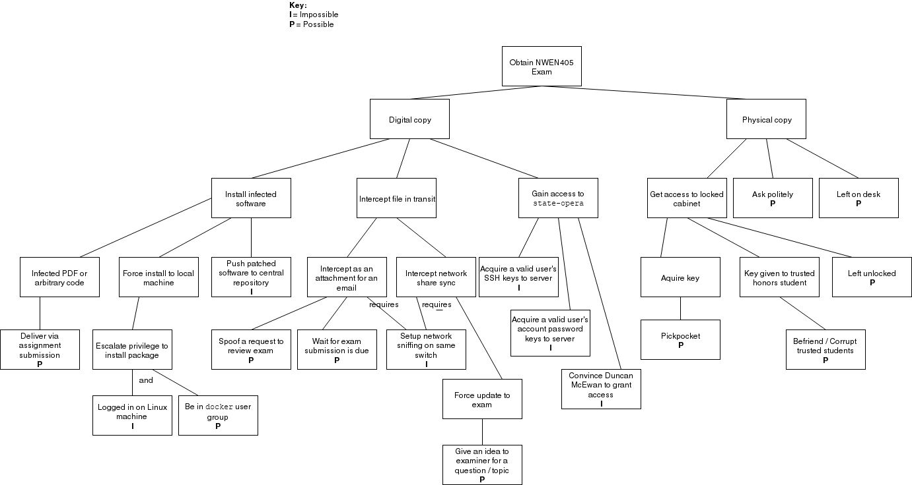

% NWEN405 - Assignment 1
% David Barnett - 300313764

# Question 1 - Computer Security Concepts 

## a)

Privacy is a right of an individual to not have private information publicly
disclosed without consent.
An example of this is a patient has privacy rights to their medical records
so they may choose who can access them, such as trusted individuals like their GP.

Confidentially is the intention of keeping some information secret.
For example encrypting a message so only Bob can see Alice's message.

The key differences between these two concepts are:
 * that privacy is focused on the individual's right to keep information private, and
 * confidentially is focused on the intention of keeping the given information private.

## b)

A service that would have a moderate level of availability could be one
that provides a service that could be substituted easily if unavailable or
is not critical to the use of a greater service.
For example a single node in a cloud environment has a moderate availability
as they are generally built with commodity hardware and would be prone to fail.
This is would be fine for the greater service as there are enough nodes to
absorb the loss of availability of a single node over a large number of nodes.

## c)

The use of encryption can prevent some passive attacks on a user's data.
A release of message contents attack has the intent of reading a message
transmitted by some user. This involves reading the messages send by the
user, the use of encryption would prevent this information being read.
However, if they were to use traffic analysis on the encrypted messages
the user sent some information can still be scraped.
This is because the message will still retain some metadata about the message
itself unencrypted as it is required for the protocol or application to function.

## d)

The principle of least privilege is minimising the privilege of an
application or user to only what they require for the current task and request
more when required. If this is applied to the given context the user would
be prompted to elevate only the programs that require administration access,
as an operating system updater.
This would help to improve the security of their system so that any other programs
that are executed would not automatically be granted administration access.
This would of lessen the impact of the ransomware attack but would most likely
not prevent it.

## e)

An attack surface is the potential of an application or service to be
leveraged in the event on an attack, for example having anonymous access
to an FTP server or having the ECHO server open to the internet.

An attack tree is a formal method to describe the security of a system
by detailing the various methods that could attack a system with increasing
detail with the depth of the tree.

The difference between an attack surface and an attack tree is an
attack surface is the potential methods that could be utilised.
Where an attack tree uses the attack surfaces to describe the
security of the system.

## f)

# Question 2 - Malware

## a)

The three main propagation mechanisms for malware are: infection, exploitation and
social engineering.

To propagate via infection a malware would modify another program to include
the code for the virus itself.
To propagate itself the malware would then need to infect other applications
or devices, such as corrupting USB firmware or networked drives.
An example of this would be a malware that upon execution would embed itself
into the operating system and infect USB devices so it can then propagate to
more systems via the system user's USB devices.

Exploitation of bugs and misusing features is another method for malware to propagate.
The main idea behind this propagation technique is to exploit bugs in applications
and services to achieve a goal such as privilege escalation, arbitrary code execution, 
and so on. An example of this would be worms that would exploit weakness in network
protocols or applications to propagate themselves. An example would be a worm
is programmed to exploit a foreign code execution bug that would allow it to send
itself to the target machine and execute itself.

Social engineering is another method to propagate malware.
To use this propagation technique the attacker must have the intention to
trick the user to execute the malware, such as posing to be a useful program like
Photoshop. An example of this is providing cracks to popular applications or games
to trick users into installing the software, with presumably administration rights.
This can also be propagated via attachments for emails from "reputable" sources
or social media.

## b)

Four (plus a bonus) methods that a virus could conceal itself:

 1. Encrypts or compresses the main body of code
 2. Modifies its own code such that antivirus software cannot match a signature
    to it, e.g. padding itself with `NOOP` instructions
 3. Modifies the code of every infection so no two infections look the same,
    some may be found but maybe not all of them
 4. Disabling antivirus or other intrusion detection services
 5. Instructing the user to disable their antivirus via social engineering

## c)

### (i)

You should be suspicious of the game, as those permissions are
unrelated to the task you are installing it for.
This is because the game would have very little legitimate use
for these permissions than exploiting them or harvesting data.

### (ii)

Given the permissions of sending SMS messages and the address book
your phone has taken on the threat of being taken over to be used
a spam bot to send spam to contacts or paid SMS services.
This is because the mobile operating system has universal method
to prevent any abuse, some may prevent obvious abuse like
thousand of messages per minute, of these functions after the permission
is granted. In more modern versions of the mobile operating systems
a permission can be revoked after the fact which provides some mitigation
to these types of attacks.

### (iii)

The app would be a malware that has been propagated via social engineering.
This is due to desire to install the suspicious free version has been
created by the social desire to jump on the current trend and this malware
is exploiting that by providing a "free" version.

## d)

### (i)

An antivirus program would help to block a macro virus via email attachments.
This is because an antivirus program would be able to scan the contents of the
email attachments and have a database of malware signatures to be able to compare
the attachment to thus have a chance to stop the virus. However, a firewall
would be able to help since it can only filter the packets that are passed
by applications by lower layers of the network stack.
 
### (ii)

A firewall is the best tool to use to block a backdoor. This is because
with a firewall the user can configure it such that only known services are
permitted to send outward bound network traffic. By using a firewall 
the backdoor will be blocked from sending traffic back to its control server
thus making it useless.
An antivirus software cannot block the backdoor like a firewall,
but it could be able to detect malware operating the backdoor and remove it.
Since the use of a firewall can block the backdoor without knowledge of it,
the use of a firewall is better to block the use of backdoors over antivirus software.

## e)

Antivirus software use a range of heuristics scanners and activity traps to 
detect if some software is infected but not necessarily able to detect what it is.
This is because the heuristic scanners and activity traps monitor the system for
what they define as suspicious activity, such as an odd arrangement of system
calls, attempts to access kernel memory, etc.
These techniques are able to detect that some program is operating in an infected
manner and the antivirus can stop this. However, the observed behaviour
cannot be easily used to identify the virus as it may be proxying through different
exploits in many programs to hide the origin and that many viruses can use 
the same techniques and being able to differentiate between them is an undecidable problem
from behaviour alone.

## f)

### (i)

APT: targeted attack
Banking Trojan:

### (ii)

APT: targeted attack
Banking Trojan:

### (iii)

APT: education of social attacks
Banking Trojan: 

# Question 3 - Denial-of-Service (DoS)  attacks

## a)

The aim of for a denial-of-service attack on different resources
all have the aim of reducing or preventing the availability of the resource.
By targeting different resources they impact other resources.
For example by targeting the network bandwidth the other networked services
using that bandwidth is also denied, for example a bot net spamming a
node to saturate a link.
A denial-of-service attack on system resources, such as memory, disk or
CPU usage, not only the service under attack is impacted but all services
on the computer. An example of this would be using an exploit in the zip
format to decompress 4KiB to 4 terabytes in memory to deny other applications
memory space.
Another target resource is application resources, such as database connections 
or rate-limited API calls. A denial of service attack on this would disable the
application and other services that depend on it, such as an authentication
micro service that has exhausted its database connection pool from bogus requests.

## b)

The general principle behind a reflection attack is to
forge a request such that the response will be sent to
the target and not the attacker.
It is more advantageous for the attacker if the response is 
larger than the request allowing for a amplification of the attack
and can be requested anonymously.
An example of this would be forging a DNS request such that
the response IP address is set to the target rather than back
to the attacker.

## c)

## d)

## e)

### (i)

### (ii)

### (iii)

## f)

### (i)

### (ii)

### (iii)
