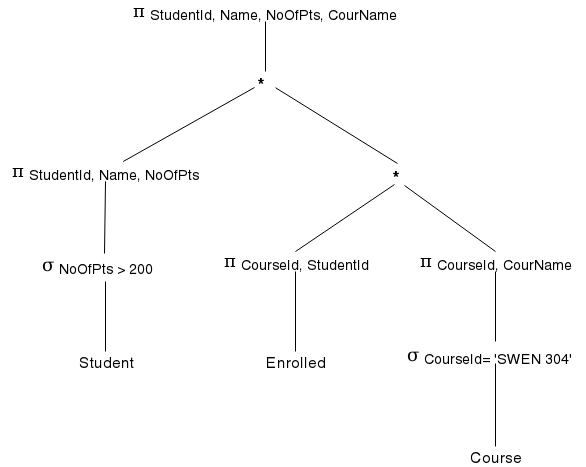

% SWEN304 - Assignment 2
% David Barnett (300313764)

# Question 1

## A)

### 1)

#### Relational Algebra

\begin{equation*}
\pi_{Mus\_Name} ( \sigma_{Mus\_Type = "Conductor"} ( r(Musician) ) )
\end{equation*}


#### Tutorial D

```
(Musician WHERE Mus_Type = 'Conductor') { Mus_Name }
```

### 2)

#### Relational Algebra

\begin{equation*}
\pi_{Mus\_Name, Inst\_Name} ( \sigma_{Mus\_Type = "Singer"} ( r(Musician) ) \ast r(Played\_By) \ast r(Instrument) )
\end{equation*}

#### Tutorial D

```
((Musician JOIN (Played_By JOIN Instrument)) WHERE (Mus_Type = "Singer")) {Mus_Name, Inst_Name}
```

### 3)

#### Relational Algebra

\begin{equation*}
    \begin{split}
       \\
        (&\pi_{Mus\_Name} ( \sigma_{Inst\_Name = "Piano"} ( r(Musician) \ast ( r(Instrument) \ast r(Played\_By) ) ) ) \\
        \cup \\
        &\pi_{Mus\_Name} ( \sigma_{Inst\_Name = "Violin"} ( r(Musician) \ast ( r(Instrument) \ast r(Played\_By) ) ))) \\
         - \\
         &\pi_{Mus\_Name} ( \sigma_{Inst\_Name = "Guitar"} ( r(Musician) \ast ( r(Instrument) \ast r(Played\_By) ) ) )
\end{split}
\end{equation*}

#### Tutorial D

```
((((Musician JOIN (Played_By JOIN Instrument)) WHERE (Inst_Name = 'Piano')) UNION
((Musician JOIN (Played_By JOIN Instrument)) WHERE (Inst_Name = 'Violin')))
MINUS
((Musician JOIN (Played_By JOIN Instrument)) WHERE (Inst_Name = 'Guitar'))) {Mus_Name}
```

## B)

### 1)

#### English

Retrieve the musician id and name of all musicians that do not
play an instrument.

#### Tutorial D

```
((Musician) {MusicianId, Mus_Name}) MINUS ((Musician JOIN Played_By) {MusicianId, Mus_Name})
```

### 2)

#### English

Retrieve the Instrument id and instrument name and count
of number of musicians for that instrument.

#### Tutorial D

```
SUMMARIZE (Instrument JOIN Played_By) PER ((Instrument JOIN Played_By) {InstrumentId, Inst_Name} )
ADD (COUNT() AS C)
```

# Question 2

## A)

### 1)

$\pi_{StudentId, Name, NoOfPts, CourName} (
 \sigma_{NoOfPts > 200 \wedge CourseId = 'SWEN304'}
(
    r(Student) \ast r(Enrolled) \ast r(Course)
))$


### 2)

See figure 1 for query tree.


### 3)

\begin{align*}
    &\pi_{(StudentId, Name, NoOfPts, CourName)} ( \\
    &\pi_{(StudentId, Name, NoOfPts)} (\sigma_{(NoOfPts > 200)}(r(Student))) \ast \\
    &\pi_{StudentId, CourName} (\pi_{(StudentId, CourseId)} (r(Enrolled)) \ast \\
    &\pi_{(CourseId, CourName)} (\sigma_{(CourseId = 'SWEN304')} ( r(Course) ) )))
\end{align*}

See figure 2 for query tree.



## B)

### 1)

#### Values

$r_s = 20000$
$r_e = 300000$

The size of a tuple in the Students table is

Column      | Size (bytes)
------------+--------------
`StudentId` | 4\*
`Name`      | 15\dag{}
`NoOfPts`   | 2
`Tutor`     | 4\*

Total: $1 + 15 + 2 + 4 = 25\text{ bytes}$

$f_s = \lfloor \frac{block}{size} \rfloor =  \lfloor \frac{500}{25} \rfloor  = 20$

$b_s = \lceil \frac{r_s}{f_s} \rceil = \lceil \frac{20000}{20} \rceil =  1000$

The size of a tuple in the Enrolled table is

Column      | Size (bytes)
------------+--------------
`StudentId` | 4\*
`CourseId`  | 15\dag{}
`Term`      | 2
`Grade`     | 15

Total: $4 + 15 + 2 + 15 = 36\text{ bytes}$

\pagebreak

$f_e = \lfloor \frac{block}{size} \rfloor = \lfloor \frac{500}{36} \rfloor = 13$

$b_e = \lceil \frac{r_e}{f_e} \rceil = \lceil \frac{300000}{13} \rceil = 23077$


\begin{equation*}
\begin{split}
    n &= \lfloor \frac{buffer size}{block size} \rfloor \\
      &= \lfloor \frac{4000}{500} \rfloor \\
      &= 8
\end{split}
\end{equation*}

\begin{equation*}
\begin{split}
    f &= \lfloor \frac{buffer size}{tuple size} \rfloor \\
      &= \lfloor \frac{500}{25 + 36} \rfloor \\
      &= 8
\end{split}
\end{equation*}


**Assumptions**

> \*: Assuming the `PRIMARY KEY` type is 4 bytes

> \dag: Assuming a `char` type is 1 byte (i.e is ASCII instead of UTF-8 or Unicode encoded)


#### Relational algebra of selection:

$r(Student) \Join_{Student.StudentId = Enrolled.StudentId} r(Enrolled)$

#### Expression tree of query

See figure 2


#### Cost function

\begin{equation*}
    C = b_n + b_m \lceil \frac{b_n}{n - 2} \rceil + \lceil \frac{r_m}{f} \rceil
\end{equation*}

Solving for $Student \Join Enrolled$

\begin{equation*}
\begin{split}
    C &= b_s + b_e \lceil \frac{b_s}{n - 2} \rceil + \lceil \frac{r_e}{f} \rceil \\
      &= 1000 + 23077 \lceil \frac{1000}{8 - 2} \rceil + \lceil \frac{300000}{8} \rceil \\
      &= 1000 + 23077 * 167 + 37500 \\
      &= 1000 + 3853859 + 37500 \\
      &= 3892359
\end{split}
\end{equation*}


### 2)

#### Relational Algebra expression

\begin{equation*}
    \sigma_{Term = 2014 \wedge CourseId = 'SWEN304' } (r(Enrolled))
\end{equation*}

#### Expression tree

See figure 3


#### Calculating Cost

$b$ is the number of blocks of the input relation

In this case $b = 23077$

$s$ is the selection cardinality of the search argument Y

It is assumed that each year equal number of enrollments and
that in each year there are even enrollments into each course.
This implies the expected cardinality of the selection is
$\frac{300000}{(2017 - 2007) * 500} = \frac{300000}{5000} = 60$. In this case $s = 60$

Assuming that the student records are only over the past ten years.

$f$ is the block factor

\begin{equation*}
\begin{split}
    f &= \lfloor \frac{buffer size}{tuple size} \rfloor \\
      &= \lfloor \frac{500}{36} \rfloor \\
      &= 13
\end{split}
\end{equation*}

##### Linear Search

\begin{equation*}
\begin{split}
    C = b + \lceil \frac{s(Y)}{f} \rceil
\end{split}
\end{equation*}

\begin{equation*}
\begin{split}
    C &= b + \lceil \frac{s(Y)}{f} \rceil \\
      &= 23077 + \lceil \frac{60}{13} \rceil \\
      &= 23077 + 5 \\
      &= 23082
\end{split}
\end{equation*}

##### Index Search

Given that $m = \frac{f}{2} = \frac{8}{2} = 2$ and $h = 7$

\begin{equation*}
\begin{split}
    C &= h + \lceil  \frac{s}{m} \rceil + s + \lceil  \frac{s}{f} \rceil \\
      &= 7 + \lceil  \frac{30}{4} \rceil + 30 + \lceil  \frac{60}{13} \rceil \\
      &= 7 + 8 + 30 + 5 \\
      &= 50
\end{split}
\end{equation*}

#### Discussion

In this case the Index search is faster as the two attributes being queried on
are part of the primary key of the relation.
This resulted in a ~500 times speed up between the two algorithms.

# Question 3

**Note: These queries were performed on
my own postgres instance running 9.6.4**

## A)

The results of the query is shown below

```
swen304_a2=# explain select count(*) from customer where no_borrowed = 6;
                           QUERY PLAN
-----------------------------------------------------------------
 Aggregate  (cost=114.41..114.42 rows=1 width=8)
   ->  Seq Scan on customer  (cost=0.00..114.25 rows=63 width=0)
         Filter: (no_borrowed = 6)
(3 rows)
```

The type of `no_borrowed` was changed from `integer` to `smallint` as the number
of borrowed items would not reasonable exceed 32767 (upper limit of a `smallint`).
After adding an index to the table via the SQL below yielded the `explain` to give the
estimated cost of 4.83.

```sql
CREATE INDEX ON customer (no_borrowed);
```

```
swen304_a2=# explain select count(*) from customer where no_borrowed = 6;
                                             QUERY PLAN
-----------------------------------------------------------------------------------------------------
 Aggregate  (cost=4.82..4.83 rows=1 width=8)
   ->  Index Only Scan using customer_no_borrowed_idx on customer  (cost=0.28..4.75 rows=27 width=0)
         Index Cond: (no_borrowed = 6)
(3 rows)
```

This is a 95.78% speed up compared to the original query.
This speed up has occurred by the DBMS indexing each tuple in the relation
into a table index via the `no_borrowed` attribute, with this the values
are grouped into buckets of the same values which cause the estimated cost to
fall by such large margins.

## B)

Below are the original results of the query plan.

```
swen304_a2=> explain select * from customer where customerid = 4567;
                        QUERY PLAN                         
-----------------------------------------------------------
 Seq Scan on customer  (cost=0.00..114.25 rows=1 width=56)
   Filter: (customerid = 4567)
(2 rows)
```

By making the customer id a primary key there was a speedup
of 93% for the query. The results of the `EXPLAIN` are below.
This is due to indexing allows for a shortcut to tuple values which
then gives a fast speedup compared to not having them.
This is akin to changing a lookup from seeking through an array to
indexing in a B+-tree or hash table, orders of magnitude faster.


```sql
ALTER TABLE customer ADD PRIMARY KEY (customerid);
```

```
swen304_a2=# explain select * from customer where customerid = 4567;
                                  QUERY PLAN
-------------------------------------------------------------------------------
 Index Scan using customer_pkey on customer  (cost=0.28..8.30 rows=1 width=56)
   Index Cond: (customerid = 4567)
(2 rows)
```


## C)

```
swen304_a2=# explain select clb.f_name, clb.l_name, noofbooks
from (select f_name, l_name, count(*) as noofbooks
from customer natural join loaned_book
group by f_name, l_name) as clb
where 3 > (select count(*)
from (select f_name, l_name, count(*) as noofbooks
from customer natural join loaned_book
group by f_name, l_name) as clb1
where clb.noofbooks<clb1.noofbooks)
order by noofbooks desc;
                                                 QUERY PLAN

---------------------------------------------------------------------------------------
 Sort  (cost=91.97..91.99 rows=8 width=136)
   Sort Key: clb.noofbooks DESC
   ->  Subquery Scan on clb  (cost=3.30..91.85 rows=8 width=136)
         Filter: (3 > (SubPlan 1))
         ->  HashAggregate  (cost=3.30..3.53 rows=23 width=136)
               Group Key: customer.f_name, customer.l_name
               ->  Hash Join  (cost=1.52..3.10 rows=26 width=128)
                     Hash Cond: (loaned_book.customerid = customer.customerid)
                     ->  Seq Scan on loaned_book  (cost=0.00..1.26 rows=26 width=4)
                     ->  Hash  (cost=1.23..1.23 rows=23 width=132)
                           ->  Seq Scan on customer  (cost=0.00..1.23 rows=23 width=132)
         SubPlan 1
           ->  Aggregate  (cost=3.82..3.83 rows=1 width=8)
                 ->  HashAggregate  (cost=3.30..3.53 rows=23 width=136)
                       Group Key: customer_1.f_name, customer_1.l_name
                       Filter: (clb.noofbooks < count(*))
                       ->  Hash Join  (cost=1.52..3.10 rows=26 width=128)
                             Hash Cond: (loaned_book_1.customerid = customer_1.customer
id)
                             ->  Seq Scan on loaned_book loaned_book_1  (cost=0.00..1.2
6 rows=26 width=4)
                             ->  Hash  (cost=1.23..1.23 rows=23 width=132)
                                   ->  Seq Scan on customer customer_1  (cost=0.00..1.2
3 rows=23 width=132)
(21 rows)

```

The estimated cost of the query is 91.99.
This is an inefficient query as the HashAggregate against the results of SubPlan1
is re-applied over each row.
Thus the estimated cost of it is $3.53 * 23 = 81.19$ which blows
the total estimated cost to 91.

The optimized query is:

```sql
SELECT f_name, l_name, COUNT(*) as noofbooks FROM Customer NATURAL JOIN loaned_book
    GROUP BY f_name, l_name ORDER BY COUNT(*) DESC LIMIT 3;
```

The explain is:

```
swen304_a2=# explain select f_name, l_name, count(*) as noofbooks from customer natural join
loaned_book group by f_name, l_name order by count(*) DESC LIMIT 3;
                                       QUERY PLAN                                        
-----------------------------------------------------------------------------------------
 Limit  (cost=3.83..3.83 rows=3 width=136)
   ->  Sort  (cost=3.83..3.88 rows=23 width=136)
         Sort Key: (count(*)) DESC
         ->  HashAggregate  (cost=3.30..3.53 rows=23 width=136)
               Group Key: customer.f_name, customer.l_name
               ->  Hash Join  (cost=1.52..3.10 rows=26 width=128)
                     Hash Cond: (loaned_book.customerid = customer.customerid)
                     ->  Seq Scan on loaned_book  (cost=0.00..1.26 rows=26 width=4)
                     ->  Hash  (cost=1.23..1.23 rows=23 width=132)
                           ->  Seq Scan on customer  (cost=0.00..1.23 rows=23 width=132)
```

The speed up of 95.76%.
This assumes that in the case that there are 100 1\^{st} / 2\^{nd} / 3\^{rd} equal 
do not all need to be in the final result and the top 3 borrowers of books is good enough.
This speedup is a result of removing the sub-queries that repeated work that could not
be optimised.
However the use of `COUNT(*)` multiple times in the optimized query is only
calculated once and removed the need for a sub-query.

The use of sub-queries would of blown out the estimated cost.
This is due to the estimated cost for sub-queries are multiplied by
the number of rows they operate over, so even if the query has an estimated
cost of 1 if it runs over 5 or more tuples it will not reach the goal of 
95% speedup.
