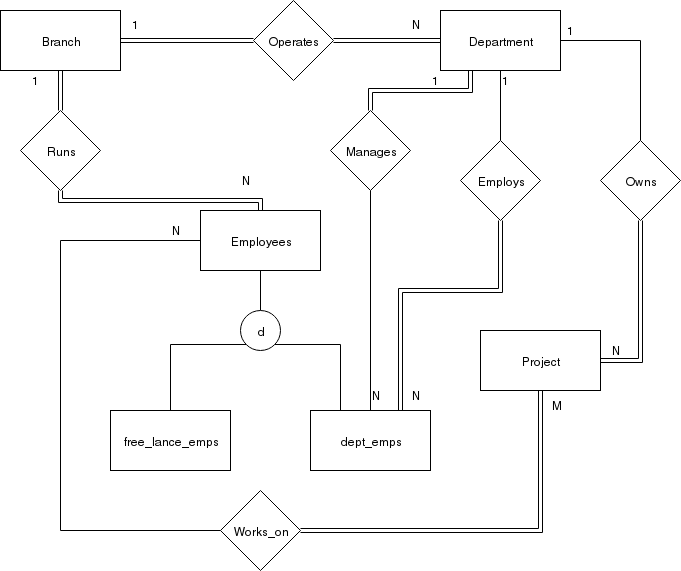

% SWEN304 - Assignment 4
% David Barnett (300313764)

# Question 1 - Functional Dependencies and Normal Forms

## A

 1. $A \rightarrow B$ - holds for the instance, all values of $A$ map to a single value of $B$

 2. $B \rightarrow A$ - Does not hold, not all values of $B$ map to a single value of $A$, e.g. $2 \rightarrow 1$ and $2 \rightarrow 4$

 3. $B \rightarrow C$ - holds for the instance, all values of $B$ map to a single value of $C$

## B

**Note: the key is $AB$**

 1. $F = \{ AB \rightarrow C, C \rightarrow D \}$

1NF holds - no nested relations

2NF holds - no functional dependency's left hand side is a subset of the key

3NF does not holds - there exists a transitive relation between functional dependencies
between $AB \rightarrow C$ and $C \rightarrow D$ which turns into $AB \rightarrow D$ via
the transitive rule.

The functional dependencies are in the 2NF as it is the highest normal form that holds.

 2. $F = \{ AB \rightarrow D, B \rightarrow C \}$

1NF holds - no nested relations

2NF does not hold - the functional dependency $B \rightarrow C$'s left hand side ($B$) is a subset of the key $AB$.

The functional dependencies are in the 1NF as it is the highest normal form that holds.

 3. $F = \{ AB \rightarrow C, AB \rightarrow D \}$

1NF holds - no nested relations.

2NF holds - no functional dependency's left hand side is a subset of the key.

3NF holds - no functional dependency is transitive to another dependency.

BCNF holds - all functional dependencies in the set has there left hand side is a super key  of or equal to $AB$

The functional dependencies are in the BCNF as it is the highest normal form that holds.

 4. $F = \{ AB \rightarrow C, C \rightarrow B \}$

1NF holds - no nested relations.

2NF holds - no functional dependency's left hand side is a subset of the key.

3NF holds - no functional dependency is transitive to another dependency.

BCNF does not holds - not functional dependencies in the set has there left hand side are a super key  of or equal to $AB$,
in this case $C \rightarrow B$'s left hand side is not a super key of $AB$.

The functional dependencies are in the 3NF as it is the highest normal form that holds.

# Question 2 - Minimal Cover of a set of Functional Dependencies

Initial set $F = \{ A \rightarrow B, B \rightarrow C, CD \rightarrow A , AC \rightarrow D \}$

## 1. Decomposition of right hand side

$F = \{ A \rightarrow B, B \rightarrow C, CD \rightarrow A , AC \rightarrow D \}$

No decomposition required.

## 2. Reduce Redundant Attributes

Only two functional dependencies have more than once attribute on the
left hand side to the checked if they can be reduced,
$CD \rightarrow A$ and $AC \rightarrow D$.

Checking $CD \rightarrow A$

$(CD - C)^{+}_{F - \{ CD \rightarrow A \}} = (D)^{+}_{F - \{ CD \rightarrow A \}} = D$

Closure of attribute does not contain the removed attribute, $C$ from $CD \rightarrow A$
is not redundant.

$(CD - D)^{+}_{F - \{ CD \rightarrow A \}} = (C)^{+}_{F - \{ CD \rightarrow A \}} = C$

Closure of attribute does not contain the removed attribute, $C$ from $CD \rightarrow A$
is not redundant.

Checking $AC \rightarrow D$

$(AC - A)^{+}_{F - \{ AC \rightarrow D \}} = (C)^{+}_{F - \{ AC \rightarrow D \}} = C$

Closure of attribute does not contain the removed attribute, $A$ from $AC \rightarrow D$
is not redundant.

$(AC - C)^{+}_{F - \{ AC \rightarrow D \}} = (A)^{+}_{F - \{ AC \rightarrow D \}} = ABC$

Does include the removed attribute, $C$ from $AC \rightarrow D$ is redundant and can be
removed.

The resulting functional dependencies is:

$F = \{ A \rightarrow B, B \rightarrow C, CD \rightarrow A , A \rightarrow D \}$

## 3. Remove Redundant Functional Dependencies

$F = \{ A \rightarrow B, B \rightarrow C, CD \rightarrow A , A \rightarrow D \}$

Testing if  $A \rightarrow B$ is redundant:

$(A)^{+}_{F - \{ A \rightarrow B \}} = AD$

The right hand side of the functional dependency is not contained in the
result of the closure, it is not redundant.

Testing if  $B \rightarrow C$ is redundant:

$(B)^{+}_{F - \{ B \rightarrow C \}} = B$

The right hand side of the functional dependency is not contained in the
result of the closure, it is not redundant.

Testing if  $CD \rightarrow A$ is redundant:

$(CD)^{+}_{F - \{ CD \rightarrow A \}} = CD$

The right hand side of the functional dependency is not contained in the
result of the closure, it is not redundant.

Testing if  $A \rightarrow D$ is redundant:

$(A)^{+}_{F - \{ A \rightarrow D \}} = ABC$

The right hand side of the functional dependency is not contained in the
result of the closure, it is not redundant.

No functional dependencies are redundant.

The minimal cover is:

$F = \{ A \rightarrow B, B \rightarrow C, CD \rightarrow A , A \rightarrow D \}$

# Question 3 - Normalization

## A)

$R = \{ A, B, C, D \}$

$F = \{ A \rightarrow B, C \rightarrow D \}$

### 1. Identify Keys

$R = \{ A, B, C, D \}$

$(ABCD)^{+}_{F} = ABCD$ A possible candidate key since all attributes are in
the resulting closure.

$(ABCD - A)^{+}_{F} = (BCD)^{+}_{F} = BCD$ Not a key, as all attributes of the
relation is not in the resulting closure.

$(ABCD - B)^{+}_{F} = (ACD)^{+}_{F} = ABCD$ A possible candidate key
since all attributes are in the resulting closure.

$(ACD - C)^{+}_{F} = (AD)^{+}_{F} = ABD$ Not a key, as all attributes of the
relation is not in the resulting closure.

$(ACD - D)^{+}_{F} = (AC)^{+}_{F} = ABCD$ A possible candidate key
since all attributes are in the resulting closure.

The key is $AC$ as it is the minimal candidate key.

### 2. Highest Normal Form

The highest normal form is 1NF, as there is no nested relations.
However, it does not meet the 2NF's test of all functional dependencies
much not have a left hand side that is a sub-set of the key, which is the case
for both functional dependencies.

### 3. Lossless transformation to 3NF

$F = \{ A \rightarrow B, C \rightarrow D \}$

$K = { AC }$

#### Computing Minimal Cover

 1. Decompose right hand side

No functional dependencies have multiple attributes on the right hand side, no action required

 2. Reducing left hand side

No functional dependencies have multiple attributes on the left hand side, no action required

 3. Removing redundant functional dependencies

$(A)^{+}_{F - \{ A \rightarrow B \}} = A$

$A \rightarrow B$ not redundant

$(C)^{+}_{F - \{ C \rightarrow D \}} = C$

$C \rightarrow D$ not redundant

The minimal cover is $F = \{ A \rightarrow B, C \rightarrow D \}$

#### Group Functional Dependencies by left-hand side

$R_{A} = \{ A \rightarrow B \} = R_{A}(\underline{A}, B)$

$R_{C} = \{ C \rightarrow D \} = R_{C}(\underline{C}, D)$

#### Handle Left over attributes

No left over attributes, no action needed

#### Testing lossless property

$R_{A} \cap R_{C} = \emptyset$

Neither keys of $R_{A}$ or $R_{C}$ are contained in the other relation.

This is a lossy join decomposition as we have not built the universal relation
from applying the lossless join decomposition algorithm.

## B)

$R = \{ A, B, C, D \}$

$F = \{ B \rightarrow C, CD \rightarrow A, B \rightarrow D \}$

### 1. Identify Keys

$R = \{ A, B, C, D \}$

$(ABCD)^{+}_{F} = ABCD$ A possible candidate key since all attributes are in
the resulting closure.

$(ABCD - A)^{+}_{F} = (BCD)^{+}_{F} = ABCD$ is a possible candidate key since
all attributes are in the resulting closure.

$(BCD - B)^{+}_{F} = (CD)^{+}_{F} = ACD$ is **not** a possible candidate key since
not all attributes are in the resulting closure.

$(BCD - C)^{+}_{F} = (BD)^{+}_{F} = ABCD$ is a possible candidate key since
all attributes are in the resulting closure.

$(BD - D)^{+}_{F} = (B)^{+}_{F} = ABCD$ is a possible candidate key since
all attributes are in the resulting closure.

$B$ is the key since it is the minimal candidate key.

### 2. Highest Normal Form

The highest normal form is 3NF.
The relation meets the 1NF test of no nested relations.
The relation meets the 2NF test of no functional dependency can have the left hand side as a subset of the key.
The relation meets the 3NF test of no functional dependencies are transitive.

### 3. Lossless transformation to 3NF

There is no need to perform the transform to 3NF as relation is already at 3NF.

## C)

$R = \{ A, B, C, D \}$

$F = \{ A \rightarrow C, D \rightarrow B, BC \rightarrow A, BC \rightarrow D \}$

### 1. Identify Keys

$R = \{ A, B, C, D \}$

$(ABCD)^{+}_{F} = ABCD$ A possible candidate key since all attributes are in
the resulting closure.

$(ABCD - A)^{+}_{F} = (BCD)^{+}_{F} = ABCD$ is a possible candidate key
since all attributes are in the resulting closure.

$(BCD - B)^{+}_{F} = (CD)^{+}_{F} = ABCD$ is a possible candidate key
since all attributes are in the resulting closure.

$(CD - C)^{+}_{F} = (D)^{+}_{F} = DB$ is **not** a possible candidate key
since not all attributes are in the resulting closure.

$(CD - D)^{+}_{F} = (C)^{+}_{F} = C$ is **not** a possible candidate key
since not all attributes are in the resulting closure.

The key is $CD$ since it is the smallest candidate key found though there are other
candidate keys with the same length, such as $AD$ and $BC$.

For simplicity the key $BC$ is used as it matches most of the functional
dependencies.

### 2. Highest Normal Form

The highest normal form of the relation is 3NF as the 
relation meets 1NF, 2NF and 3NF.
The relation meets 1NF as there is no nested relations.
The relation meets 2NF as there is no functional dependency that has
a left hand side that is a subset of the key, $BC$.
The relation meets the 3NF as there is no transitive functional dependencies.

### 3. Lossless transformation to BCNF

$R = \{ A, B, C, D \}$

$F = \{ A \rightarrow C, D \rightarrow B, BC \rightarrow A, BC \rightarrow D \}$

Key = $BC$

#### Iteration 1:

The functional dependency $D \rightarrow B$ violates BCNF as it is not a
super key of $BC$.

$R_{1} = \{ A, C, D \}$

$F_{1} = \{ A \rightarrow C, C \rightarrow A, C \rightarrow D \}$

Key for $R_{1} = C$

$R_{1}$ is not in BCNF due to $A \rightarrow C$

$R_{2} = \{ B ,D \}$

$F_{2} = \{ D \rightarrow B \}$

Key for $R_{2} = D$

$R_{2}$ is in BCNF

# Question 4 - Enhanced Entity Relationship

See figure 1

## Assumptions

 * That there has to be some employee running a branch
 * That a free-lancer can run a branch
 * A free-lancer can work on any project
 * A manager can only manage one department
 * A department can have multiple managers

# Question 5 - Mapping EER to Relation Data Model

## Step 1. Mapping of regular entity types

$Student(\{StudentId, S\_Name\}, StudentId)$

$Course(\{CourseId, C\_Name \}, CourseId)$

$Term(\{Trimester, Year\}, \{Trimester + Year\})$

$Lecturer(\{LecturerId, L\_Name\}, LecturerId)$

## Step 2. Mapping of weak entity types

There are no weak entities in the EER.

## Step 3. Mapping of binary 1:1 relations

There is no 1:1 relations in the EER.

## Step 4. Mapping of binary 1:N relations

There is no 1:N relations in the EER.

## Step 5. Mapping of binary N:M relations

$Enrolls(\{StudentId, CourseId, Grade\}, \{ StudentId + CourseId \})$

$Student[StudentId] \subseteq Enrolls[StudentId]$

$Enrolls[StudentId] \subseteq Student[StudentId]$

$Enrolls[CourseId] \subseteq Coruse[CourseId]$

$Course[CourseId] \subseteq Enrolls[CourseId]$

$Null(Enrolls, StudentId) = False$

## Step 6. Mapping of multivalued attributes

No multivalued attributes.

## Step 7. Mapping of N-ary relationship types

Modified $Term$ to $Term(\{TermId, Trimester, Year\}, \{TermId, Trimester + Year\})$

$Taught\_By(\{CourseId, LectuerId, TermId\}, \{ CourseId, LectuerId, TermId \} )$

$Course[CourseId] \subseteq Taught\_By[CourseId]$

$Lecturer[LecturerId] \subseteq Taught\_By[LecturerId]$

$Term[TermId] \subseteq Taught\_By[TermId]$

$Taught\_By[CourseId] \subseteq Course[CourseId]$

$Taught\_By[LecturerId] \subseteq Lecturer[LecturerId]$

$Taught\_By[TermId] \subseteq Term[TermId]$

## Step 8. Mapping of IS-A hierarchies

There is no IS-A hierarchies in this EER
