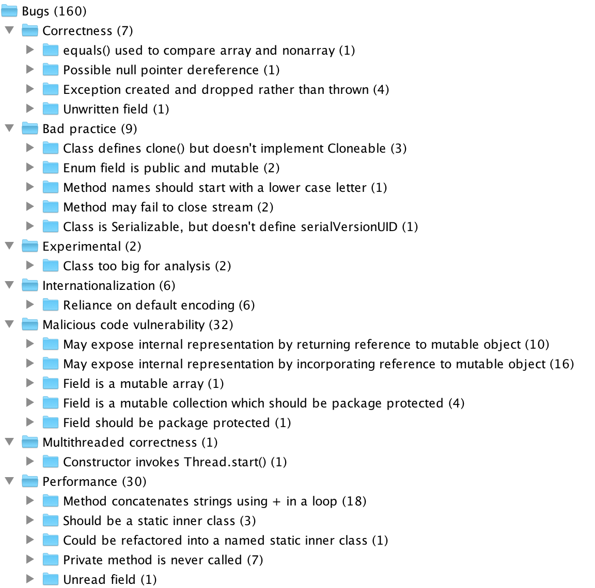

% Assignment 3 - FindBugs - ENGR441
% David Barnett (300313764)

This report will review multiple static analysis tools and some example usage of them.

# FindBugs

[FindBugs](http://findbugs.sourceforge.net/) is a static analysis tool for Java.
It identifies a large range of issues using what they call *bug patterns*.
The bug patterns not only check for common issues such as not implementing `hashCode()` if you
have overridden `equals` and also checks for common security vulnerabilities and concurrency problems.

FindBugs can be used in multiple ways from plugins for IDEs and build systems to standalone a GUI and CLI.
The source code is optional when checking for bugs as FindBugs uses the bytecode for static analysis.

## Capabilities of FindBugs

FindBugs has 8 distinct categories of bugs and 424 bug patterns implemented currently implemented.
The categories are:

* Bad practice
* Correctness
* Experimental
* Internationalization
* Malicious code vulnerability
* Multithreaded correctness
* Performance
* Security
* Dodgy code

To find these bug patterns FindBugs use a variety of methods to statically identify them.
A majority of the methods are based off control flow graphs built from the bytecode.

## Examples

For most of the examples I will be using what I have found while analysing the Whiley Compiler.

The following results use FindBugs version 3.0.1 scanning the entire source tree of Whiley Compiler.
FindBugs reports that is a possible 160 bugs, and 73 dodgy code in the Whiley Compiler. Though
inspecting some of these report some are valid others false positives.

One example is a check for cases falling through in switch statement, in all cases where this is
detected in the source code contains a comment explaining the behaviour.
Another interesting example is a check for initialised exceptions that are never thrown, in all of 
these cases it is unsure if these are programmer error or not.

# Java Path Finder

[Java Path Finder](http://babelfish.arc.nasa.gov/trac/jpf/) (JPF) is a static analysis tool for
java that combines model checking and various other types of checks.
At its core JPF is a java virtual machine that takes every execution path.
Each run of JPF has a configuration that encodes what properties to check in the execution, this can range
from correct usage of concurrent methods or unhandled exceptions.
The execution are explored with backtracking and state matching to check all paths.
The backtracking is used to go back to a branch point to try out a range of input values.
State matching is when JPF identifies that it has entered a similar state again and determines that it does not 
need to re-explore that execution path again.

## Capabilities of JPF

## Examples

# Soot

[Soot](https://sable.github.io/soot/) is a static analyser for Java that was built originally 
to optimise byte code but now is used to analyse and instrument Java applications.

## Capabilities of Soot

## Examples
