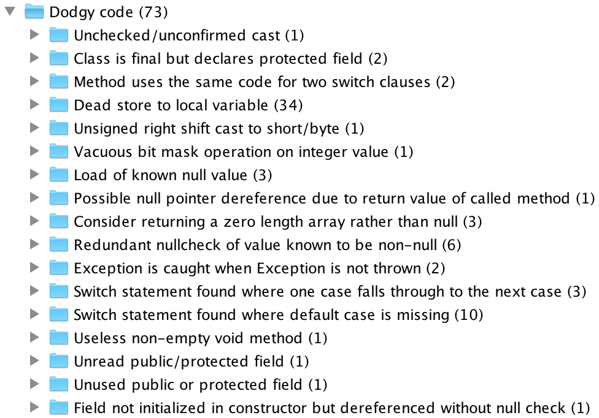

% Assignment 3 - FindBugs - ENGR441
% David Barnett (300313764)

# What is FindBugs

[FindBugs](http://findbugs.sourceforge.net/) is a static analysis tool for Java.
It identifies a large range of issues using what they call *bug patterns*.
The bug patterns not only check for common issues such as not implementing `hashCode()` if you
have overridden `equals` and also checks for common security vulnerabilities and concurrency problems.

FindBugs can be used in multiple ways from plugins for IDEs and build systems to standalone a GUI and CLI.
The source code is optional when checking for bugs as FindBugs uses the bytecode for static analysis.

# Capabilities of FindBugs

# Examples

For most of the examples I will be using what I have found while analysing the Whiley Compiler.

The following results use FindBugs version 3.0.1 scanning the entire source tree of Whiley Compiler.
FindBugs reports that is a possible 160 bugs, and 73 dodgy code in the Whiley Compiler. Though
inspecting some of these report some are valid others false positives.

One example is a check for cases falling through in switch statement, in all cases where this is
detected in the source code contains a comment explaining the behaviour.
Another interesting example is a check for initialised exceptions that are never thrown, in all of 
these cases it is unsure if these are programmer error or not.

# What changes I made to FindBugs

## Troubles

Getting the FindBugs source code is easy, compiling it is hard.
