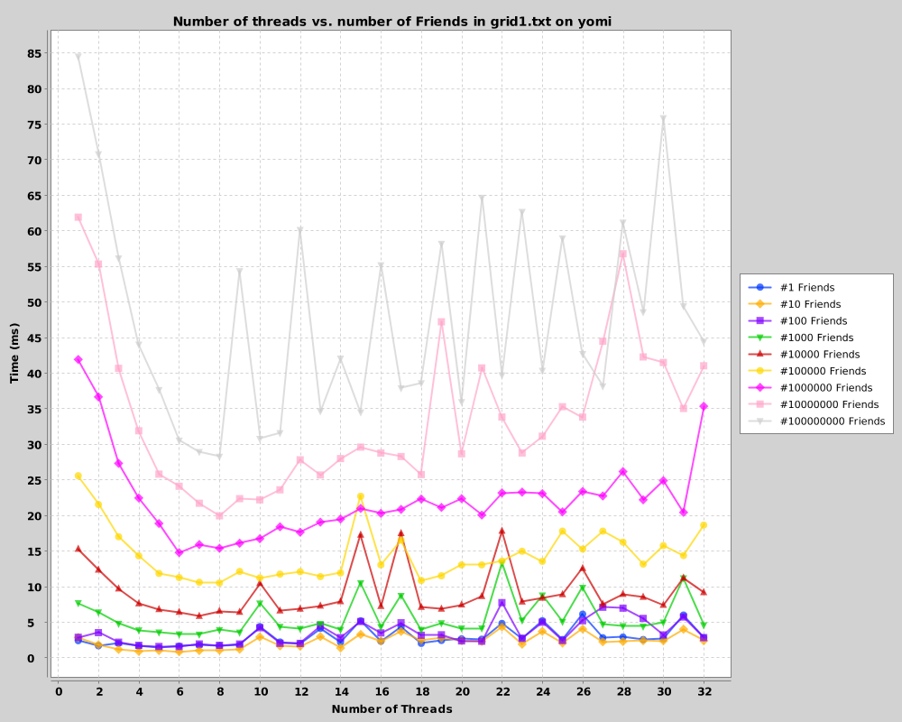
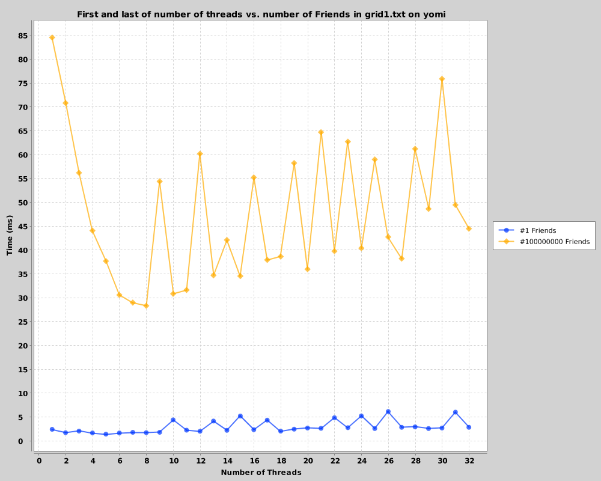
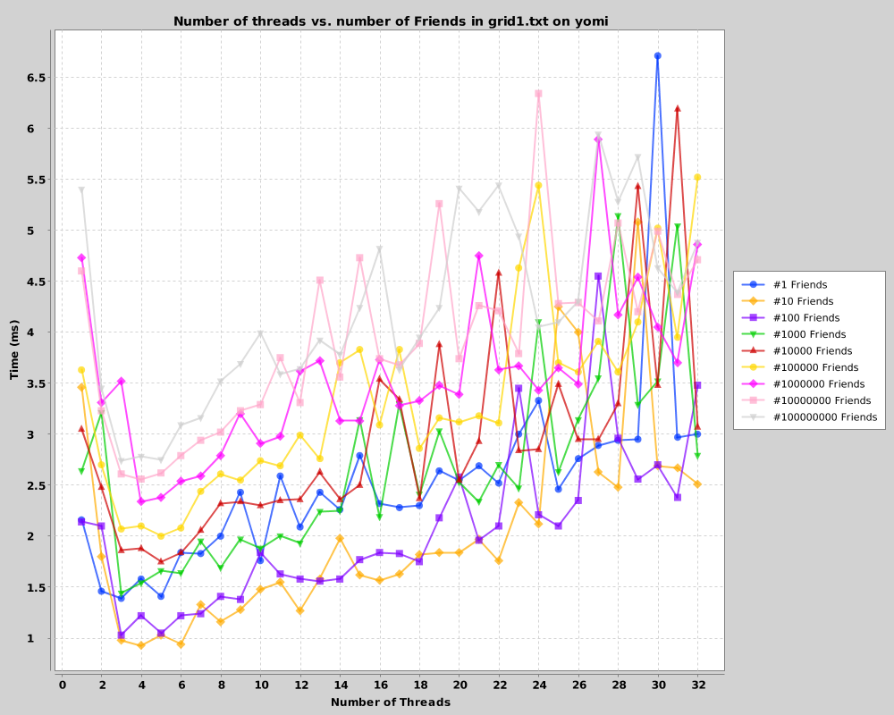
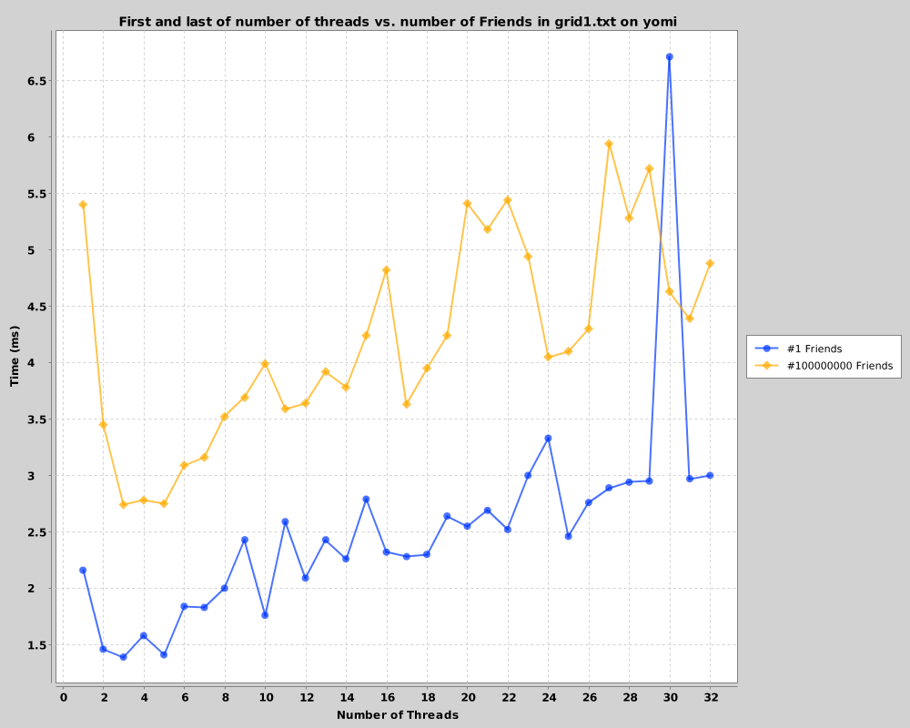
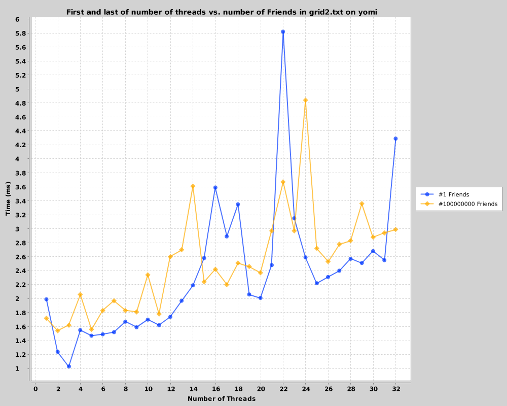
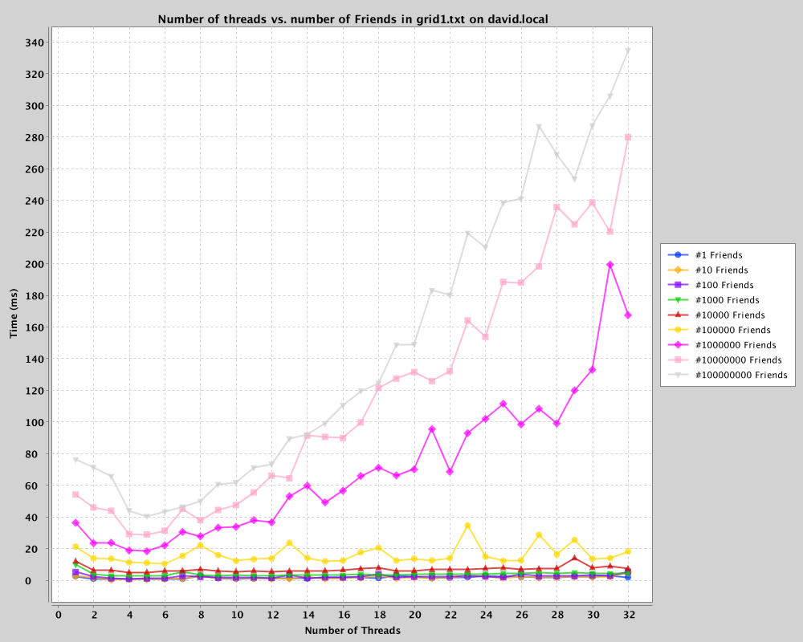
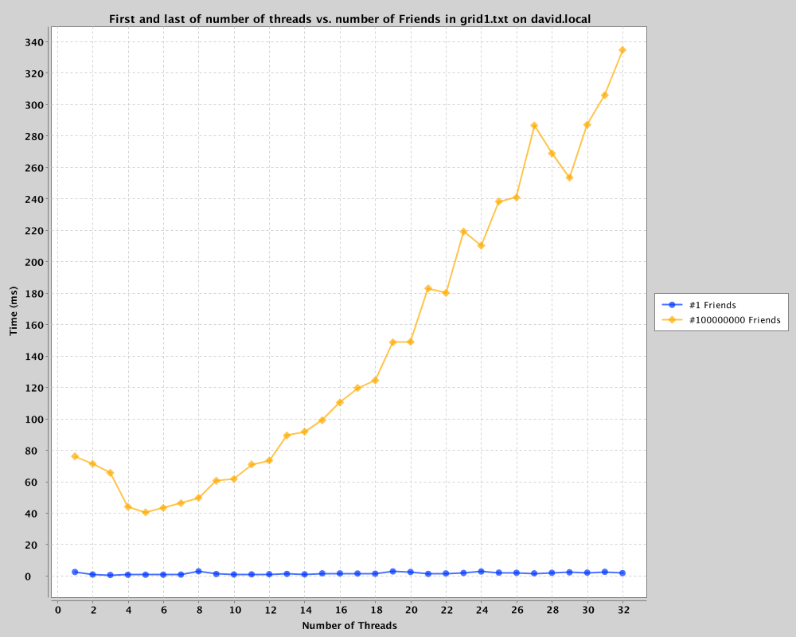
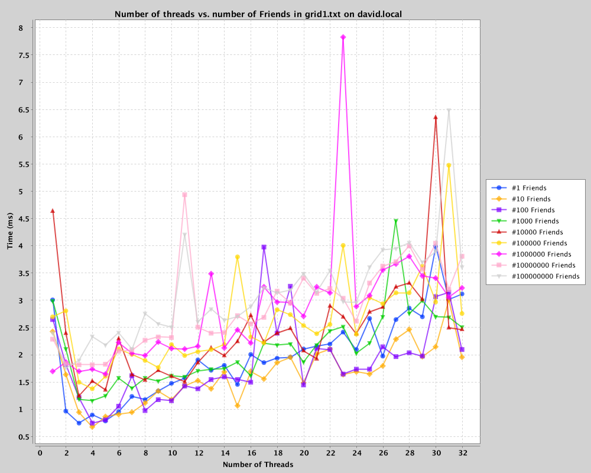
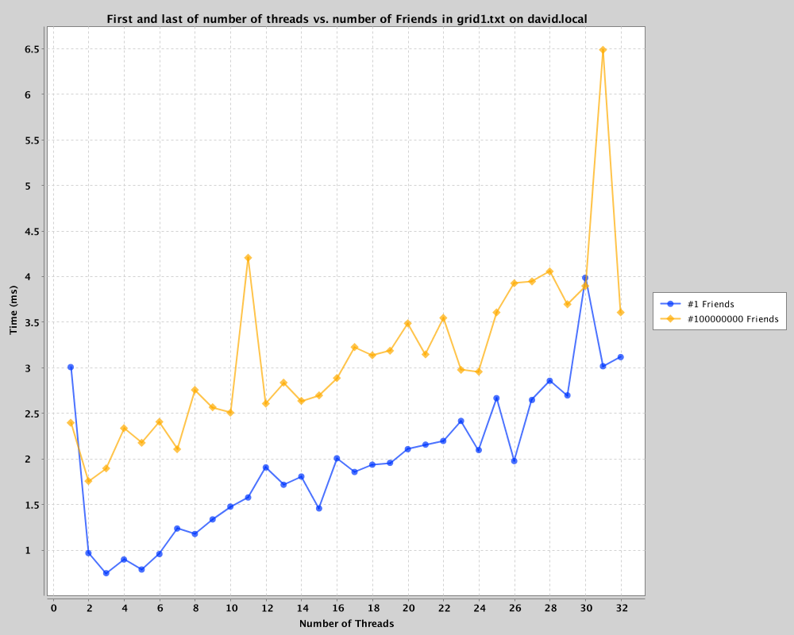

% NWEN303 Project 1 - Report
% David Barnett (300313764)

# Problem

A group of friends need to get to the next pub which is just beyond a
peculiarly placed maze.

# Solution

## How to run

I would recommend the usage of IntelliJ's IDEA IDE and unzipping the `code.zip`, 
this should just be a simple 'project with existing source' import _fingers crossed_ .

The main function of the program expects the first parameter to be the path from the working
directory to a map, in most cases it should just be something like: `grid1.txt`

The program will then start running the experiment, some debugging functions have been
left, primarily in the `Maze` class and most notably `Maze.display` which is handy for
inspecting the entire maze in a breakpoint.

## Architecture

The main classes of this program are:

 * `Crawler` which contains the logic for the friends to make
it to the next pub as a group

 * `Square` which represents a tile of the Maze
and,

 * `Maze` class which holds all the `square`s and `crawler`s moving through the Maze.

The main idea behind the architecture is to approach each iteration of the main loop
is one step of a `Crawler`. To make this run in parallel multiple threads run through
the main loop at once. To achieve this the `Maze` object holds a queue
of the next crawler's step to be processed.

A static number of threads are used during the computation of the maze, they are used
as worker threads that will continue to ask the `Maze` if it is done yet and do busy wait's
for new `Crawler`'s to compute.

A common theme to ensure correctness is the usage of Atomic objects with back-offs or
just re-calculating values. This can best be seen in the `move` method of `Crawler` which
bubbles up failures in atomic actions, backs-off and reschedules to try again later if it fails,
otherwise it precedes with confidence that it has successfully recorded its result.

### Crawler

_A group of friend(s) on their way to the pub_

The `Crawler` class represents the friends moving their way through the maze to the next
pub. The major pieces of functionality of the `Crawler` class is the `step` method which
holds all the logic to navigate through the maze.

The main interactions between threads inside a `Crawler` object is at first checking
if another thread is processing the step by checking an `AtomicBoolean`, this is a very basic
non-blocking lock on the object which is very rarely hit due to how the processing queue in the
`Maze` is laid out.

Another major interaction between threads in `Crawler` is during moving between
squares and during splits. When a `Crawler` moves it will check if its destination is occupied,
if it is it will attempt to merge with it by checking if it is currently being processed (if it
is it will back off and check again later as the other crawler is in an undefined state) check if
it they are still there. If we make it through all the pre-conditions we attempt to zero our group's
size (this is done with a compare & swap, and if we noticed our group sized changed we back-off)
and add our group size to the other crawler. After a successful merge the empty crawler will be
removed from the maze given that no one else has merged into in the mean time.

The Crawler objects only care for concurrency with other Crawlers that they run into directly and
only ever merge into other crawlers when they hit them to prevent any Crawler having to second guess
if their group suddenly got stolen, only if they get added to.
This comes into play when a Crawler reaches an intersection where it has to split and walk down
every interaction. To achieve this the crawler repeats attempts at trying to lower its own group size
to a minimum of 1 so it can split up into smaller groups and make new Crawlers to look down other paths. When splitting up the group the original crawler will compute one `move` for each of the
new crawlers and add them to the `Maze`'s queue if they succeed otherwise merges them back into the
original group.

### Square

_just another tile in the Maze_

The `Square` class is a tile of the maze and holds which Crawler is currently on it and
the markings that have been made.
Mutating the `Square`'s markings is only done by the single Crawler that is current on the
square. This is governed by the `AtomicReference<Crawler>` in the Square class which is updated
as a part of the Crawler's method `step`.

The square has no interaction to other threads but multiple threads could access a thread and mutate
at once. To control these interactions Atomic References are used to ensure a one thread does not override
the progress made by another thread. This is done for keeping track of who is on the square and what marks
have been placed, in particular the protocol around updating a mark from unvisited to alive to throughly checked
to ensure it does not override a more important marking such as golden route or dead end.

### Maze

_The one thing stopping this good night_

The `Maze` hold all the `Square`s that make it up as a grid and also holds the queue of `Crawler`s
to be computed. As well as it independently holds how many people have entered and left the maze
to ensure no one is left behind or find a cloning machine along the way.

The major concurrent component in the `Maze` class is the `crawlersQueue` which holds all the
`Crawler`'s that have steps to be computed. This is filled by checking the result of the `Crawler`'s
`step` method which flags it to say it has more steps to be computed or is at the end / an empty group.

### Handling Threads

All threads are created before the start of searching though
the maze. They all compete for a crawler's step to compute which
is stored in a non-blocking queue from the Java standard library.
This does imply that some threads will be in a busy wait loop trying to
get the next element.

# Results

From the data collected (below, primarily figures 1 and 2) I have found that solving the
maze concurrently does improve the speed of solving the maze overall till the number of 
threads excessed the computer's CPU count.
This is best illustrated by the first and last graphs. In general the graphs
show a small trend of increasing in time to complete is correlated to the number of threads
used, with the exception of a minimum around the core count of the computer the data is from.
The data also shows a common theme of layering with the number of friends showing that
the number of friends in the party has greater general affect on the total time than
the number of threads, this is most likely causes by the common case of the group
splitting up at all intersections.

One variation tried on the specified algorithm was changing the behaviour to split at an
intersection of all alive routes to randomly pick one path to go down in this case.
The results of the (below, figures 3 and 4 for the 8 core dataset) show a large amount of
variation between the number of threads. This greatly increased the time to complete the 
maze as it reduced the number of total crawlers in the maze at one time and sped up the process
to have little different between each magnitude of friends.
There is however a large amount of noticeable variance between each number of threads but still show the general
trend, the variance is very likely a side-affect of the design decision of backing off from
moving or merging Crawlers as it they fail to complete their operation they add another to
the queue so the total number of items processed increases with the number of threads with
the exception of thread counts under the processor's CPU count. This behaviour is also
apart of having split at all intersections but is less noticeable as the affect of
having greatly more Crawlers in the maze cause more of a slow down.

Further improvements that could be made to the algorithm could be to reduce the number of cases
where the crawler will back-off from an action or allow it to make another decision in that step
to reduce the number of repeated steps computed.

Lighthouse was not tested as my program used many Java 8 features what were very troublesome to
port back to Java 7 (which lighthouse runs).

## Thoughts

My solution to the problem does not give a well suited solution to painting more than 
one golden path from the start to the end goal. The main hurdle to achieve this
is to deicide which paths are good enough to go back and paint gold and how to tell the
difference between, which may result in needed some kind of diffing algorithm to decide if
a path was different enough. Another hurdle would be how to differentiate gold paths in-case
painting two gold paths create a loop for a naive walker or coming to an intersection where they
diverge and having to choose one. However without this a lot of stragglers in the are not likely
to find the golden path as they would of most likely gone a wildly different path that only would
intercept at the start of the maze to the last few in the maze and having many gold paths would
reduce this in larger mazes.

## Data

#### 8-Core 

Always splits at intersections

Only splits only for unvisited intersection and picks a random
path on alive intersections.

Alternate maze design

#### 4-Core 

Always splits at intersections

Only splits only for unvisited intersection and picks a random
path on alive intersections.

