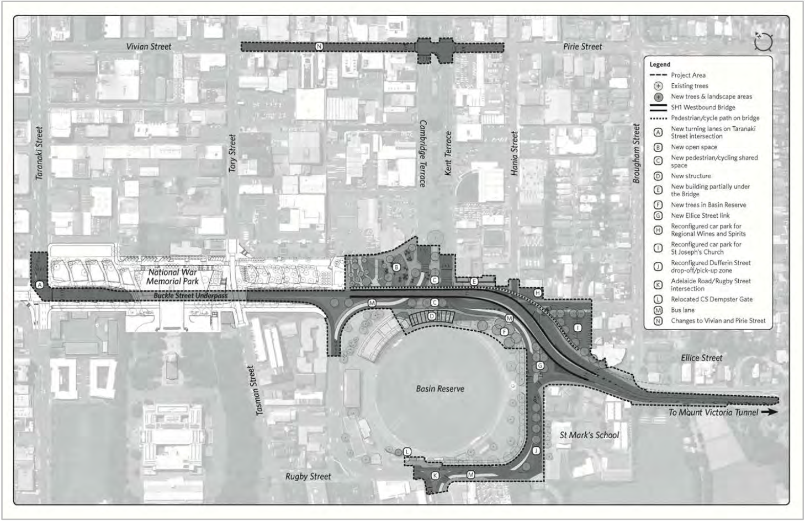

% Basin Reserve Flyover Case Study
% ENGR401 - David Barnett (300313764)

<!-- 
Aim for the case study:
    * recommend ways to improve egineering projects success

Using the view point of _legal compliance_

Areas to look at:
    * community engagement, communications
        * videos releases
        * large documents
        * how is this protected by law [find law, probably resouce management act & report section]
    * irreproducible selection process
        * How is this protected by law [find law, probably resouce management act & report section]
    * did not explore the impacts of their project
        * How is this protected by law [find law, probably resouce management act & report section]

-->

# Executive Summary 
<!--
 Breifly cover:
 * the topic area of the report
 * the report's primary aim/s
 * state what was achieved (key finding)
 * a summary of your approach
 * significant findings
 * a summary of the report's recommendations
-->

[@epa_report]

# Introduction
<!--
Summarise the brief (your task), briefly outline the case and focus on its significance for the reader,
state the report's aim(s) and describe how the report is organised.
-->
 
# Background
<!--
Describe the case or situation being investigated.
Focus on the facts of the situation.

 - it is a sub-project of the Wellington Corridor Project
 - improving the basin reserve area
 - The project was terminated in the proposal phase
 - notice of requirement, what is it?
 - proposal sent to EPA
 - goal of the RMA is to `promote the sustainable management of natural & physical resources`.
 - this was due to multiple failures to meet the requirements of the RMA
 - the area is a hertiage site, including the circket grounds, etc.
-->

The Basin Reserve flyover was a proposed solution to alleviate the congestion between Wellington City, New Zealand,
and the eastern suburbs of Wellington.
It was one component to a greater project of improve the transport of Wellington region [@northern_corridor].

\ 

> Map of the changes to the Basin Reserve

# Discussion
<!--
 - this was due to multiple failures to meet the requirements of the RMA
    - subset of these failtuers are: alteratives & hertiage site

    - alternatives 
        - "methodology,  particularly  the  need  for transparency and replicability, is important" [1273]
        - "it was not clear how criteria were weighted and the reason for any weighting.
           This made the process somewhat confusing and difficult to follow.  
           It also meant that the process could not be replicated" [1274]
        - section: 171(1) Whether adequate consideration has been given to alternative sites, routes & methods

        - highlights the requirement of transprancy when using finite resources like Land, city space, culture, anemity

    - hertiage sites
        - section 6(f) recongise & provide for protection of historic heritage from inappropriate development
        - public outcry tipped the balance & defended the Basin
        - King Salmon, case applied to '*inappropriate* development' 
        - test-cricket status of the Basin Reserve venue [1259]

        - highlights the importance of history and the community support for the site
-->

# Conclusion
<!--
Try to answer the following questions.
* What else has been achieved since the situation occurred?
* Have all recommendations been implemented?
* What may happen in the future?
-->

\pagebreak
